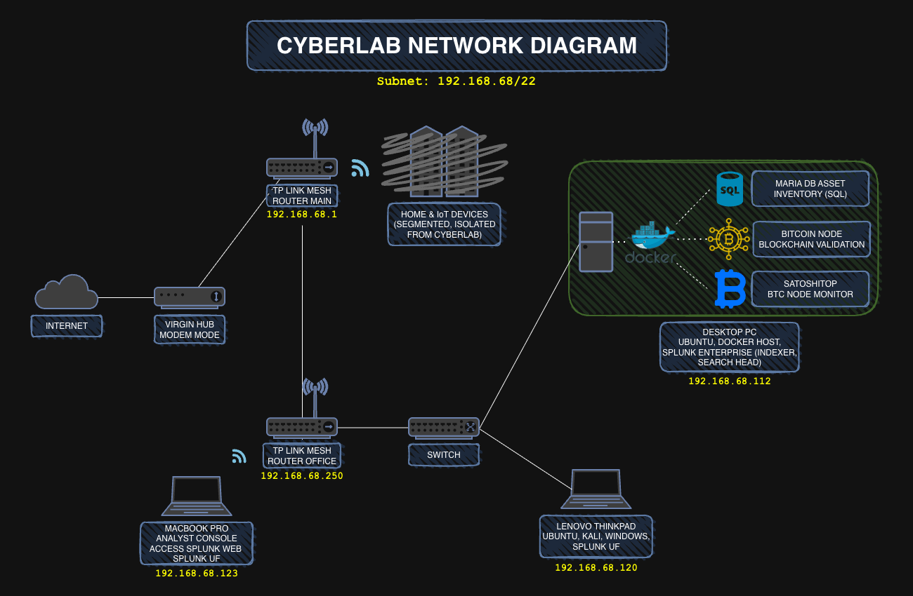

# 🧪 Cyberlab

This project is built to simulate the day-to-day workflows of a real-world Security Operations Center (SOC).  
From log collection and threat detection to alert creation and response testing, the lab provides a safe and flexible space to build SOC-style skills using both local and cloud-based systems.

The setup evolves over time and will include physical and virtual machines, Docker containers, custom scripts, and eventually cloud-connected agents and honeypots — all with the goal of developing a deep, practical understanding of how modern environments are monitored and secured.

Everything in this lab is designed to be reproducible, self-managed, and fully documented.

---

## 📚 Table of Contents
- [🎯 Purpose](#purpose)
- [🖥️ Current Setup](#current-setup)
- [🗺️ Roadmap](#roadmap)
- [📚 Documentation](#documentation)
- [📓 Progress Log](#progress-log)
- [📁 Repository Structure](#repository-structure)

---

## Purpose

Cyberlab is a hands-on learning environment designed to:

- Simulate a realistic SOC at home — including log collection, correlation, and alerting using Splunk (with Microsoft Sentinel planned for cloud-based expansion) 
- Explore cybersecurity concepts from both red team and blue team perspectives
- Deploy and experiment with tools like IDS/IPS, DNS sinkholes, and honeypots
- Build automation with Python, Docker, SQL, and Linux shell scripting
- Develop detection, alerting, and incident response strategies
- Document progress, challenges, and discoveries for long-term skill development

---

## Current Setup

### Hardware

- **Desktop PC - Primary SOC Server (Son-of-Anton)** - Ubuntu 24.04 LTS - Runs:
    - **Splunk Enterprise Indexer** (active, receiving on TCP 9997)
    - **Suricata IDS** (monitoring live network traffic)
    - Docker Engine
    - Bitcoin Pruned Node (conatainer, fully synced)
    - MariaDB container
  - Purpose:
    - Acts as the central SOC server
    - Receives telemetry from all other lab endpoints

- **Lenovo ThinkPad T480 – Multi-OS Lab Workstation (Cyberlab)** - Dual-boot System: Ubuntu 24.04 LTS & Windows 10 Pro
  - Kali Linux installed Ubuntu (VirtualBox)
  - Malware Analysis Sandbox installed on Windows (VMware with Windows 10)
  - Splunk Universal Forwarder installed on Ubuntu and Windows Pro 10
  - Acts as the “Branch Office” in the Cyberlab environment:
    - Hosts lightweight services purpose-built for log generation
    - NGINX static webpage (for HTTP access logs)
    - SMB network share (for simulated file operations)
    - Cron jobs scheduled to generate synthetic activity (HTTP GET requests and write a timestamped heartbeat entry to `branch-heartbeat.log`).
    - All relevant logs (nginx_access, nginx_error & branch_heartbeat) forwarded to Splunk (index=branch_office)

  - See: [NGINX setup](setup/nginx-setup.md) and [SMB / samba setup](setup/smb-samba-setup.md)

- **MacBook Pro - SOC Analyst Console**  
  - Main analyst workstation for Splunk Web interface
  - Runs a Splunk Universal Forwarder
  - Used to manage the Cyberlab environment via SSH into Desktop PC and ThinkPad

### Network

- **Virgin Media Hub** in **modem-only** mode  
- Connected directly to a **TP-Link Deco mesh system**, which acts as the main router and access point for the Cyberlab  
- **IoT devices** are isolated on a dedicated SSID (segmented from user devices)  
- Static IPs / DHCP reservations assigned to core lab devices for consistency
- See [Networking Fundamentals](docs/networking_fundamentals.md)

---

## Roadmap

**Current Focus**
- Get reliable logs into Splunk from all my main devices
- Live network visibility via Suricata IDS
- Basic dashboards and alert validation
- Simulated security security events (port scans, service probing, ...)

**Near-Term Goals**
- Expand network based detections (e.g. SSH, TLS, DNS behavior)   
- Add some basic network visibility so I can see more than just endpoint logs
- Introduce a separate device for DNS logging to widen the data sources

**Medium-Term Goals**
- Set up a small cloud-based component to bring in external traffic for analysis 
- More structured detections and investigation workflows
- Correlate endpoint and netwrok alerts

**Long-Term Goals**
- Create a few realistic attack/detection examples end-to-end
- Improve documentation, add diagrams/screenshots
- Optionally integrate a second SIEM (like Microsoft Sentinel) later   

---

## Documentation

High-level docs and setup guides live under `docs/` and `setup/`

- **Networking & fundamentals**
  - [Networking fundamentals](docs/networking_fundamentals.md)

- **Splunk dashboards**
  - [Suricata IDS Dashboard](setup/suricata-ids-setup.md)
  - [Branch Office Telemetry Dashboard](docs/splunk_dashboards/splunk_branch_office_dashboard.md)
  - [Endpoint Activity dashboard](docs/splunk_dashboards/endpoint_activity_dashboard.md)

- **Component setup guides**
  - [Docker setup](setup/docker-setup.md)
  - [MariaDB setup](setup/mariadb-setup.md)
  - [Splunk Enterprise setup](setup/splunk-enterprise-setup.md)
  - [Splunk Universal Forwarder setup](setup/splunk-universal-forwarder-setup.md)
  - [NGINX setup](setup/nginx-setup.md)
  - [SMB / Samba setup](setup/smb-samba-setup.md)
  - [Branch heartbeat setup](setup/branch-heartbeat-setup.md)
  - [Suricata IDS setup](setup/suricata-ids-setup.md)

---

## Progress Log

For a complete history of changes, updates, and development work, see the full **Progress Log**:  
➡️ [progress-log.md](progress-log.md)

---

## Repository Structure

- `assets/` — banners, screenshots
- `diagrams/` — network/topology diagrams
- `docs/` — additional documentation (e.g., networking_fundamentals.md)
- `scripts/` — automation (e.g., Nmap → SQL/Splunk)
- `setup/` — install/config notes per component
- [📓 Progress Log](progress-log.md) — running diary of changes and experiments

