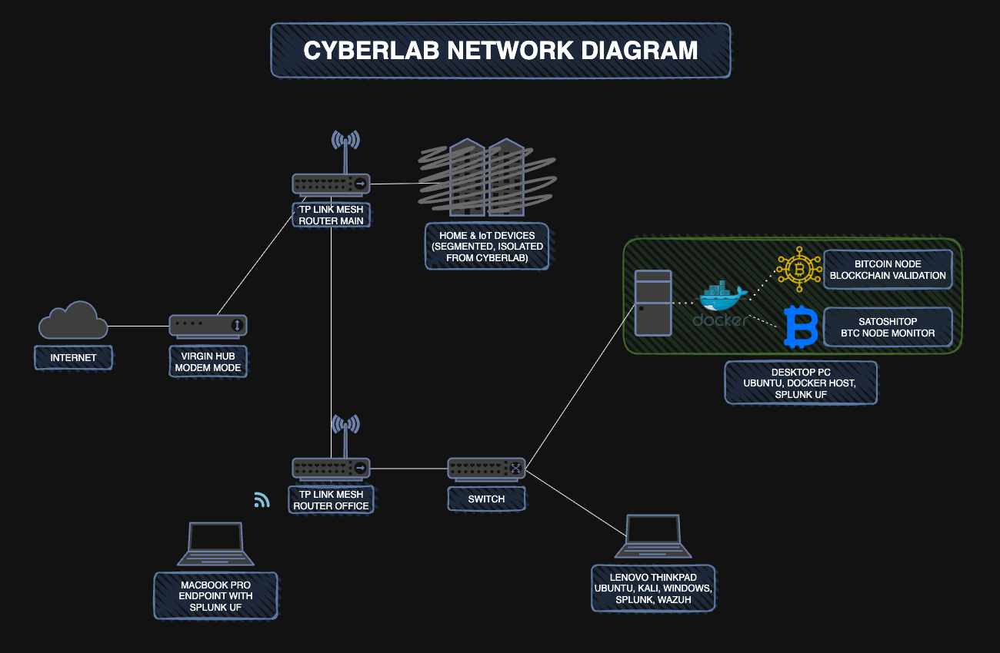

# 🧪 Cyberlab

This project is built to simulate the day-to-day workflows of a real-world Security Operations Center (SOC).  
From log collection and threat detection to alert creation and response testing, the lab provides a safe and flexible space to build SOC-style skills using both local and cloud-based systems.

The setup evolves over time and will include physical and virtual machines, Docker containers, custom scripts, and eventually cloud-connected agents and honeypots — all with the goal of developing a deep, practical understanding of how modern environments are monitored and secured.

Everything in this lab is designed to be reproducible, self-managed, and fully documented.

---

## 📚 Table of Contents
- [🎯 Purpose](#purpose)
- [🖥️ Current Setup](#current-setup)
- [🗺️ Roadmap](#roadmap)
- [📁 Repository Structure](#repository-structure)
- [📓 Progress Log](#progress-log)

---

## Purpose

Cyberlab is a hands-on learning environment designed to:

- Simulate a realistic SOC at home — including log collection, correlation, and alerting using Splunk and Wazuh
- Explore cybersecurity concepts from both red team and blue team perspectives
- Deploy and experiment with tools like IDS/IPS, DNS sinkholes, and honeypots
- Build automation with Python, Docker, SQL, and Linux shell scripting
- Develop detection, alerting, and incident response strategies
- Document progress, challenges, and discoveries for long-term skill development

---

## Current Setup

### Hardware

- **Lenovo ThinkPad T480 (primary SOC workstation)**
  - Dual-boot: Ubuntu + Windows 10 Pro
  - Kali Linux (VirtualBox on Ubuntu) for controlled attack generation and penetration testing (e.g., Nmap, Metasploit)

- **Desktop PC (simulated branch office)**
  - Ubuntu host with Docker
  - Currently running a **MariaDB 10.11** container storing a small home inventory dataset
  - Purpose: **acts as a remote/branch site** in a multi-site lab  
    - Will host lightweight branch services (e.g., SMB share with weak creds, simple web app like DVWA)  
    - Will run log forwarders / agents and feed telemetry back to the SOC (Splunk/Wazuh)

- **MacBook Pro (personal endpoint)**  
  - Planned to run a **Splunk Universal Forwarder** for endpoint log generation  
  - Provides real-world workstation telemetry for SOC analysis

### Network

- **Virgin Media Hub** in **modem-only** mode  
- Connected directly to a **TP-Link Deco mesh system**, which acts as the main router and access point for the Cyberlab  
- **IoT devices** are isolated on a dedicated SSID (segmented from user devices)  
- Static IPs / DHCP reservations assigned to core lab devices for consistency  

---

## Roadmap

**Current Focus**
- Build out a small home-SOC using Splunk (and possibly Wazuh) 
- Set up log forwarders on all lab machines for basic visibility  
- Simulate a few security events to test detections and alerts

**Next Steps**
- Create a lightweight “branch office” VM for extra network realism    
- Add DNS and web traffic visibility with Pi-hole or AdGuard 
- Keep refining dashboards and alerts once data is flowing  

**Later / Future Ideas**
- Add screenshots, diagrams, and tidy documentation  
- Write useful SPL searches and dashboards (e.g., failed logins, DNS queries, port changes)  

**Future Ideas**
- Add a simple honeypot or cloud log source for external monitoring 
- Experiment with light automation or scripting for analysis   

---

## Repository Structure

- `assets/` — banners, screenshots
- `diagrams/` — network/topology diagrams
- `scripts/` — automation (e.g., Nmap → SQL/Splunk)
- `setup/` — install/config notes per component
- [📓 Progress Log](progress-log.md) — running diary of changes and experiments