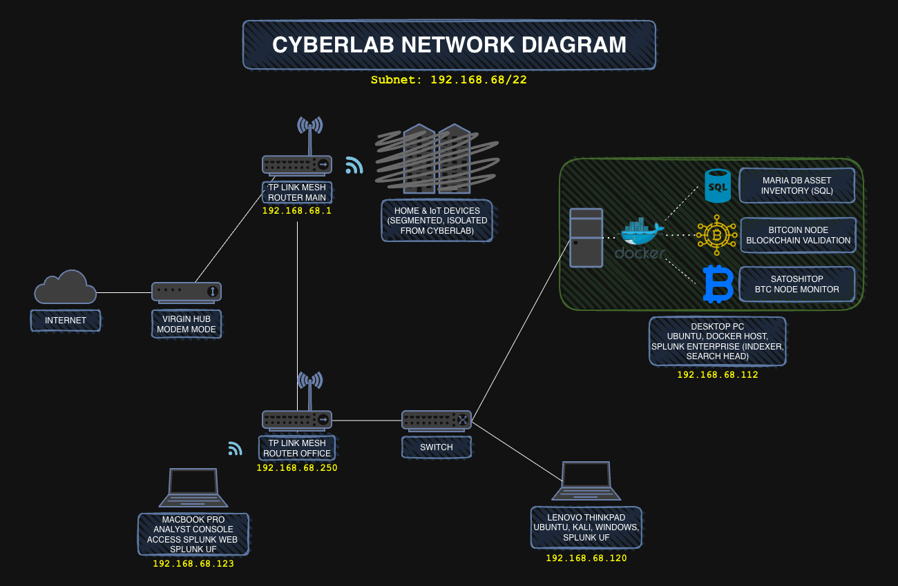

# 🧪 Cyberlab

This project is built to simulate the day-to-day workflows of a real-world Security Operations Center (SOC).  
From log collection and threat detection to alert creation and response testing, the lab provides a safe and flexible space to build SOC-style skills using both local and cloud-based systems.

The setup evolves over time and will include physical and virtual machines, Docker containers, custom scripts, and eventually cloud-connected agents and honeypots — all with the goal of developing a deep, practical understanding of how modern environments are monitored and secured.

Everything in this lab is designed to be reproducible, self-managed, and fully documented.

---

## 📚 Table of Contents
- [🎯 Purpose](#purpose)
- [🖥️ Current Setup](#current-setup)
- [🗺️ Roadmap](#roadmap)
- [📚 Documentation](#documentation)
- [📓 Progress Log](#progress-log)
- [📁 Repository Structure](#repository-structure)

---

## Purpose

Cyberlab is a hands-on learning environment designed to:

- Simulate a realistic SOC at home — including log collection, correlation, and alerting using Splunk (with Microsoft Sentinel planned for cloud-based expansion) 
- Explore cybersecurity concepts from both red team and blue team perspectives
- Deploy and experiment with tools like IDS/IPS, DNS sinkholes, and honeypots
- Build automation with Python, Docker, SQL, and Linux shell scripting
- Develop detection, alerting, and incident response strategies
- Document progress, challenges, and discoveries for long-term skill development

---

## Current Setup

### Hardware

### Hardware

- **Desktop PC — Primary SOC Server (Son-of-Anton)** *(Ubuntu 24.04 LTS)*  
  **Runs:** Splunk Enterprise (Indexer; recv **TCP 9997**), Suricata IDS, UFW, Docker: Bitcoin pruned node, MariaDB, NGINX victim (**:8080**), OWASP Juice Shop (**:3000**)  
  **Role:** Central SOC server + telemetry hub + primary victim target

- **Lenovo ThinkPad T480 — Multi-OS Lab Workstation (Cyberlab)** *(Dual-boot Ubuntu 24.04 LTS / Windows 10 Pro)*  
  **Ubuntu:** VirtualBox Kali VM; Splunk UF  
  **Windows:** VMware Win10 sandbox; Sysmon (Olaf Hartong) → Splunk UF  
  **Role:** “Branch Office” log generator (NGINX, SMB share, heartbeat cron) → forwards to `index=branch_office`  
  **Docs:** [NGINX setup](setup/nginx-setup.md), [SMB / samba setup](setup/smb-samba-setup.md)

- **MacBook Pro — SOC Analyst Console**  
  **Role:** Splunk Web + admin/SSH management of SOA and Cyberlab; Splunk UF installed

### Network

- **Virgin Media Hub** in **modem-only** mode  
- Connected directly to a **TP-Link Deco mesh system**, which acts as the main router and access point for the Cyberlab  
- **IoT devices** are isolated on a dedicated SSID (segmented from user devices)  
- Static IPs / DHCP reservations assigned to core lab devices for consistency
- See [Networking Fundamentals](docs/networking_fundamentals.md)

---

## Roadmap

**Current Focus**
- Stable telemetry into Splunk from the core Cyberlab systems
- Network visibility via Suricata IDS on SOA, plus host firewall visibility via UFW
- Build small dashboards and validate detections with controlled test activity
- Produce clean, repeatable documentation (detections, alerts, and short case write-ups)

**Near-Term Goals**
- Expand network-focused detections beyond simple scan signatures (e.g., SSH, web traffic patterns, DNS behaviour once available)
- Add more “analyst-style” workflows: alert → triage steps → quick report

**Medium-Term Goals**
- Broaden visibility beyond a single Suricata sensor position (better network coverage or additional sensor placement)
- Introduce additional telemetry sources (e.g., DNS logging) and build matching detections + dashboards
- Start correlating endpoint + network + firewall activity

**Long-Term Goals**
- Build a small set of realistic end-to-end scenarios (test activity → detection/alert → investigation notes → report)
- Optionally add a second SIEM later (e.g., Microsoft Sentinel) for comparison and expanded skill coverage  

---

## Documentation

High-level runbooks/templates, detections, alerts, incident reports/case studies, lab findings, Splunk dashboard docs, and setup guides

- **Networking & fundamentals**
  - [Networking fundamentals](docs/networking_fundamentals.md)

- **Cyberlab Incident Response Runbook**
  - [Cyberlab Incident Response Runbook](docs/ir_runbook.md)

- **Incident Report Template**
  - [Incident Report Template](docs/ir_report_template.md)

- **Detections**
  - [DET-001 Encoded Powershell (Sysmon EID 1)](docs/detections/det_001_encoded_powershell.md)
  - [DET-002 Suspicious Powershell Download/Exec (Sysmon EID 1)](docs/detections/det_002_suspicious_powershell_download.md)
  - [DET-003 BITSAdmin Transfer (Sysmon EID 1)](docs/detections/det_003_bitsadmin_transfer.md)
  - [DET-004 CertUtil Suspicious Usage (Sysmon EID 1)](docs/detections/det_004_certutil_suspicious_usage.md)
  - [DET-005 SOA UFW - Top Blocked Sources (Ports/Proto)](docs/detections/det_005_ufw_top_blocked_sources.md)
  - [DET-006 SOA UFW - Port Sweep / Multi-Port Probe(Blocks)](docs/detections/det_006_ufw_port_sweep_blocks.md)
  - [DET-007 Suricata — Nmap/Port Scan (ET SCAN by unique ports)](docs/detections/det_007_suricata_port_scan.md)
  - [DET-008 DET-008 Suricata — Web Attack Signature Burst (ET WEB / HUNTING)](docs/detections/det_008_suricata_web_attack)

- **Alerts**
  - [ALERT-001 Encoded Powershell (Sysmon EID 1)](docs/alerts/alert_001_encoded_powershell.md)
  - [ALERT-002 ET SCAN Recon Activity Detected (Port Scan/Probing)](docs/alerts/alert_002_port_scan_activity.md)
  - [ALERT-003 Juice Shop — Possible Brute Force (≥10 login requests / 5m)](docs/alerts/alert_003_possible_brute_force.md)
  - [ALERT-004 Possible SSH Brute Force (Linux Hosts) (≥5 failed logins / 5m)](docs/alerts/alert_004_possible_ssh_brute_force_linux_hosts.md)

- **Reports**
  - [IR-001 Brute Force Attempt Against OWASP Juice Shop Login (Hydra) — Detected via Splunk + Suricata](docs/reports/ir_001_brute_force_attempt_juice_shop.md)
  - [IR-002 — Suricata Web Alert Burst – Juice Shop (SOA:3000)](docs/reports/ir_002_suricata_web_alert_burst.md)
  - [CASE-001 Nmap Port Scan Against SOA Detected (Suricata + UFW corroboration)](docs/reports/case_001_nmap_scan_against_soa_detected.md)
  - [CASE-002 Web Scanner Activity Against Juice Shop Detected (Suricata + UFW corroboration)](docs/reports/case_002_web_scanner_activity.md)
  - [VULN-001 Nessus Finding: Splunk Information Disclosure Vulnerability (SP-CAAAP5E) (Fixed)](docs/reports/vuln_001_nessus_finding_splunk_info_disclosure.md)

- **Findings**
  - [Finding-001 UFW vs IPtables](docs/findings/finding_001_ufw_vs_iptables.md) - Firewall gotcha: Docker-published ports can be reachable even if they don’t appear in ufw status.
  - [Finding-002 Suricata default HOME_NET/EXTERNAL_NET settings suppress internal scan alerts in a lab](docs/findings/finding_002_suricata_settings_suppress_internal_scan_alerts.md)

- **Splunk dashboards**
  - [Windows Sysmon Dashboard](docs/splunk_dashboards/windows_sysmon_dashboard.md)
  - [Suricata IDS Dashboard](docs/splunk_dashboards/suricata_ids_dashboard.md)
  - [Branch Office Telemetry Dashboard](docs/splunk_dashboards/splunk_branch_office_dashboard.md)
  - [Endpoint Activity dashboard](docs/splunk_dashboards/endpoint_activity_dashboard.md)

- **Component setup guides**
  - [Docker setup](setup/docker-setup.md)
  - [MariaDB setup](setup/mariadb-setup.md)
  - [Splunk Enterprise setup](setup/splunk-enterprise-setup.md)
  - [Splunk Universal Forwarder setup](setup/splunk-universal-forwarder-setup.md)
  - [NGINX setup](setup/nginx-setup.md)
  - [SMB / Samba setup](setup/smb-samba-setup.md)
  - [Branch heartbeat setup](setup/branch-heartbeat-setup.md)
  - [Suricata IDS setup](setup/suricata-ids-setup.md)
  - [Sysmon setup](setup/windows-sysmon-to-splunk-setup.md)
  - [UFW host firewall setup](setup/ufw-setup.md)

---

## Progress Log

For a complete history of changes, updates, and development work, see the full **Progress Log**:  
➡️ [progress-log.md](progress-log.md)

---

## Repository Structure

- `assets/` — banners, screenshots
- `diagrams/` — network/topology diagrams
- `docs/` — documentation (networking fundamentals, templates, dashboards, detections, reports, guides)
    - `detections/` - detection write-ups / saved splunk searches
    - `alerts/` - alert write-ups
    - `reports` - incidents, cases and remediations (lab exercises & real events)
    - `findings` - lab findings & fixes (config issues,root causes, mitigations)
    - `splunk_dashboards/` - dashboard write-ups & SPL breakdowns    
- `archive_scripts/` — archived / retired scripts
- `setup/` — install/config notes per component
- [📓 Progress Log](progress-log.md) — running diary of changes and experiments

