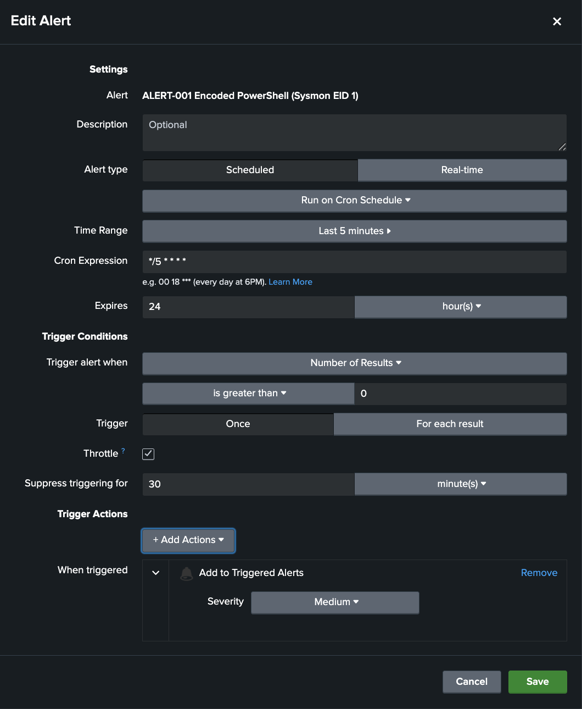
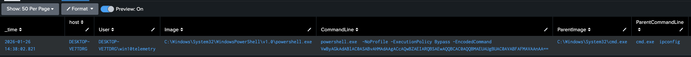

# ALERT-001 Encoded PowerShell (Sysmon EID 1)

This alert detects **PowerShell process creation** where the command line indicates **base64-encoded execution** (a common obfuscation technique used to hide payloads and evade simple inspection).

It is designed to trigger on **high-signal, analyst-actionable** activity by filtering out SYSTEM noise and focusing on interactive user context.

---

## Data Source Used in This Alert

Windows VM (Sysmon)

- Index: `sysmon`
- EventCode: `1` (Process Create)
- Key fields used: `Image`, `CommandLine`, `User`, `ParentImage`, `ParentCommandLine`, `Hashes`

---

## Alert Logic

Trigger behaviour:
- Search window: `earliest=-5m` (last 5 minutes)
- Schedule: `*/5 * * * *` (runs every 5 minutes)
- Trigger condition: **Number of results > 0**
- Throttle: **30 minutes** (prevents repeated alert spam during bursts/testing)

---

## SPL Used
```bash
index=sysmon earliest=-5m EventCode=1
(Image="*\\powershell.exe" OR Image="*\\pwsh.exe")
(CommandLine="*-EncodedCommand*" OR CommandLine="* -enc*" OR CommandLine="* -e *")
User!="NT AUTHORITY\\SYSTEM"
| table _time host User Image CommandLine ParentImage ParentCommandLine Hashes
| sort - _time
```

---

## SPL Breakdown (line-by-line)

- `index=sysmon earliest=-5m EventCode=1`
  Search Sysmon Process Create events from the last 5 minutes. This keeps the alert near-real-time and lightweight.

- `(Image="*\\powershell.exe" OR Image="*\\pwsh.exe")`
  Restrict results to PowerShell executions:
  - `powershell.exe` = Windows PowerShell
  - `pwsh.exe` = PowerShell 7+

- `(CommandLine="*-EncodedCommand*" OR CommandLine="* -enc*" OR CommandLine="* -e *")`
  Match common encoded execution flag variants:
  - `-EncodedCommand`
  - `-enc`
  - short form `-e`
  Multiple patterns are used because tooling/malware often varies spacing and shorthand.

- `User!="NT AUTHORITY\\SYSTEM"`
  Exclude SYSTEM-launched PowerShell to reduce noise. This keeps the alert focused on user-context executions that are typically more interesting to investigate.

- `| table _time host User Image CommandLine ParentImage ParentCommandLine Hashes`
  Output the core triage fields needed to quickly understand:
  - what ran (`Image`, `CommandLine`)
  - who ran it (`User`, `host`)
  - how it was launched (`ParentImage`, `ParentCommandLine`)
  - what binary/version it was (`Hashes`)

- `| sort - _time`
  Show newest matches first.

---

## Alert Configuration (Scheduled Search)

Screenshot:



This alert is configured as a **Scheduled** search so it runs automatically in the background (no manual searching required).

### Key Settings (and why they exist)

- **Alert type: Scheduled**
  - Runs on Splunk’s scheduler, not only when a user clicks “Search”.
  - This is the normal choice for “continuous monitoring” detections.

- **Cron schedule: `*/5 * * * *` (every 5 minutes)**
  - Splunk executes the SPL every 5 minutes.
  - Good balance between responsiveness and not hammering the system.

- **Time range: Last 5 minutes**
  - Each run looks back only at the most recent 5 minutes of data.
  - Keeps the search narrow and reduces duplicates versus searching large windows.

- **Trigger condition: Number of results > 0**
  - Simple logic: if the search returns anything, it’s worth flagging.
  - This works because the SPL is already selective (encoded PowerShell + non-SYSTEM).

- **Trigger: Once**
  - One alert event per scheduled run (even if multiple matching events are returned).
  - Keeps noise down and avoids spamming Triggered Alerts during bursts.

- **Throttle: Enabled — Suppress triggering for 30 minutes**
  - If the alert fires, Splunk won’t fire it again for 30 minutes (even if matches keep happening).
  - Prevents alert storms during repeated activity or testing.
  - Trade-off: you may not see repeated triggers during that window (but raw events still exist and remain searchable).

- **Expires: 24 hours**
  - Triggered alert entries are kept for 24 hours (useful for review without cluttering the alert list forever).

- **Trigger action: Add to Triggered Alerts (Severity: Medium)**
  - Logs the alert in Splunk’s Triggered Alerts list so it can be reviewed like a SOC queue.
  - Severity is Medium because encoded PowerShell is a strong signal, but in a lab it can occur during admin/testing activity.

---

## Testing / Validation (Reproducible)

Goal:
Generate a safe, controlled “EncodedCommand” PowerShell event (EID 1) and confirm:
1) the search returns an event
2) the alert triggers (Triggered Alerts)

Test steps (safe example: runs ipconfig):

Step 1 — Create a Base64 payload for “ipconfig” (PowerShell expects UTF-16LE/Unicode):
```bash
powershell -NoProfile -Command "$b=[Convert]::ToBase64String([Text.Encoding]::Unicode.GetBytes('ipconfig')); $b"
```

Step 2 — Execute the encoded command:
```bash
powershell.exe -NoProfile -ExecutionPolicy Bypass -EncodedCommand <PASTE_BASE64_FROM_STEP_1>
```

Expected result:
- Sysmon EID 1 event exists for powershell.exe
- CommandLine contains “-EncodedCommand <base64…>”
- ParentImage will likely be cmd.exe if launched from cmd
- User should be the test user (not SYSTEM), matching the alert filter

Example evidence (from a real hit in the lab):



What to check in Splunk:
- In Search: running the alert SPL manually should return the matching row(s)
- In Alerts: the alert should appear under “Triggered Alerts” shortly after the next */5 run
- Fields expected to be populated in the result table:
  _time, host, User, Image, CommandLine, ParentImage, ParentCommandLine

Notes:
- Because it’s scheduled, it will NOT necessarily trigger instantly. It triggers on the next schedule run.
- Throttle (30 minutes) can suppress repeat triggers if you spam the test multiple times.

---

## Why this is valuable

Encoded PowerShell is a common technique for:
- hiding attacker intent in base64
- reducing detection by simple string matching
- delivering “download and execute” payloads without obvious plain-text commands

This alert provides a fast signal for investigation, and the output includes enough context to immediately pivot into:
- parent/child chain review
- command line inspection (decode offline if needed)