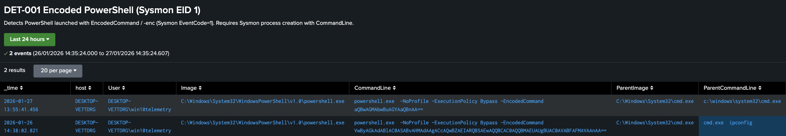

# DET-001 Encoded PowerShell (Sysmon EID 1)

This detection identifies **PowerShell executions using base64-encoded command content** (common obfuscation via `-EncodedCommand` / `-enc`).  
It is intended as a **hunt/validation search** (24h view) to quickly review encoded PowerShell activity and pivot into surrounding telemetry (parent process, user context, command line).

---

## Data Source Used in This Detection

Windows VM (Sysmon)

- Index: `sysmon`
- EventCode: `1` (Process Create)
- Key fields used: `Image`, `CommandLine`, `User`, `ParentImage`, `ParentCommandLine`, `Hashes`

---

## SPL Used
```bash
index=sysmon EventCode=1 earliest=-24h
(Image="*\\powershell.exe" OR Image="*\\pwsh.exe")
(CommandLine="*-EncodedCommand*" OR CommandLine="* -enc*" OR CommandLine="* -e *")
User!="NT AUTHORITY\\SYSTEM"
| table _time host User Image CommandLine ParentImage ParentCommandLine Hashes
| sort - _time
```

---

## Purpose

This search provides a **simple, reproducible view** of encoded PowerShell process creation in the lab so it can be:
- reviewed in bulk over a wider time range (last 24h)
- used for quick pivots into parent/child execution context
- used to confirm Sysmon logging + field extraction are working as expected

---

## Evidence (Example)

Screenshot:


---

## Related Alert

This detection is also implemented as a scheduled alert:

- [ALERT-001 Encoded PowerShell (Sysmon EID 1)](../../docs/alerts/alert_001_encoded_powershell.md)