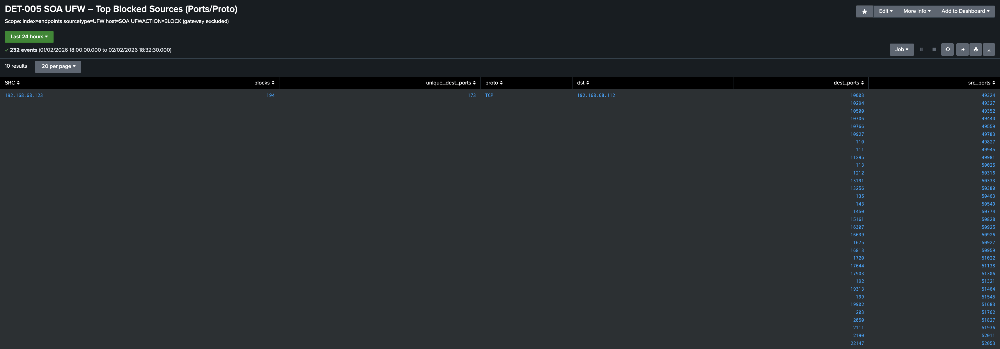

# DET-005 SOA UFW – Top Blocked Sources (Ports/Proto)

This detection summarizes **which source IPs are being blocked most often** by the desktop PC / server "SOA" host-based firewall (UFW), and includes quick context on **destination ports, source ports, and protocol** to help distinguish normal noise from probing/scanning behavior.  
It is intended as a **hunt/validation search** to quickly answer: *“Who is hitting my firewall, and what are they trying?”*

---

## Data Source Used in This Detection

SOA (Ubuntu Server) – UFW firewall logs ingested into Splunk

- Index: `endpoints`
- Sourcetype: `UFW`
- Log source: `/var/log/ufw.log`
- Key fields used: `UFWACTION`, `SRC`, `DST`, `DPT`, `SPT`, `PROTO`

Note: `UFWACTION` is extracted via a custom regex field extraction (BLOCK/ALLOW/AUDIT/etc).

---

## SPL Used
```bash
index=endpoints sourcetype=UFW host=SOA UFWACTION="BLOCK"
| search NOT SRC=192.168.68.1
| stats count as blocks
        dc(DPT) as unique_dest_ports
        values(PROTO) as proto
        values(DST) as dst
        values(DPT) as dest_ports
        values(SPT) as src_ports
  by SRC
| sort - blocks
| head 15
```

---

## SPL Breakdown (line-by-line)

- `index=endpoints sourcetype=UFW host=SOA UFWACTION="BLOCK"` - Search UFW firewall logs on SOA and only keep blocked events.
- `| search NOT SRC=192.168.68.1` - Exclude the gateway/router source IP (noise reduction).
- `| stats ... by SRC` - Summarize the results so I get one row per source IP.
- `count as blocks` - Count how many blocked events each source IP generated.
- `dc(DPT) as unique_dest_ports` - Count how many different destination ports each source IP hit. (dc = distinct count)
- `values(PROTO) as proto` - Show which protocol(s) were used (e.g., TCP/UDP/ICMP).
- `values(DST) as dst` - Show the destination IP(s) being targeted
- `values(DPT) as dest_ports` - List the destination port(s) targeted.
- `values(SPT) as src_ports` - List the source port(s) used.
- `| sort - blocks` - Sort so the biggest offenders are at the top.
- `| head 15` - Only show the top 15 source IPs.

---

## Purpose

This search provides a **fast, reproducible view** of the most frequent blocked sources against SOA so it can be:
- reviewed quickly during investigations (“what’s getting blocked right now?”)
- used to spot basic probing patterns (many unique destination ports)
- used to sanity-check that UFW logging + Splunk ingestion/field extraction are working as expected

---

## Notes / Tuning

- The gateway IP (`192.168.68.1`) is excluded because it generates high-volume local multicast/broadcast noise that would otherwise dominate the results and reduce signal quality.
- `unique_dest_ports` is a fast indicator:
  - **1** often suggests a targeted service probe
  - **>1** can suggest scanning / multi-port probing (confirm via `dest_ports` list)

---

## Evidence (Example)

Screenshot:
