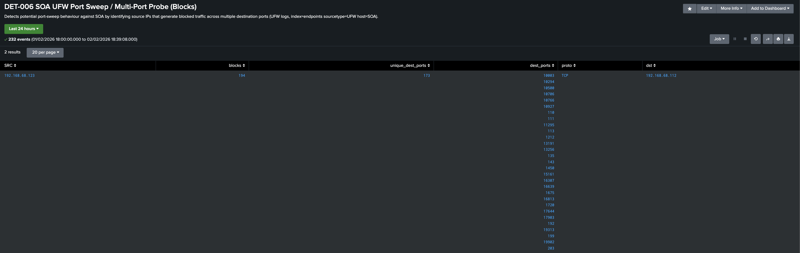

# DET-006 SOA UFW Port Sweep / Multi-Port Probe (Blocks)

This detection identifies **single-source hosts probing multiple destination ports** on SOA where traffic is being **blocked by UFW**.  
It is intended as a **hunt/validation search** to spot scan-like behaviour (multi-port probing) and quickly review which ports/protocols were targeted.

---

## Data Source Used in This Detection

SOA (Ubuntu Server) - UFW host firewall logs

- Index: `endpoints`
- Sourcetype: `ufw`
- Host: `SOA`
- Key fields used: `UFWACTION`, `SRC`, `DST`, `DPT`, `PROTO`

---

## SPL Used
```bash
index=endpoints sourcetype=UFW host=SOA UFWACTION="BLOCK"
| search NOT SRC=192.168.68.1
| stats
    count as blocks
    dc(DPT) as unique_dest_ports
    values(DPT) as dest_ports
    values(PROTO) as proto
    values(DST) as dst
  by SRC
| where unique_dest_ports >= 5
| sort - unique_dest_ports - blocks
| head 20
```

---

## SPL Breakdown (line-by-line)

- `index=endpoints sourcetype=UFW host=SOA UFWACTION="BLOCK"` - Search SOA’s UFW events where the firewall action is **BLOCK**.
- `| search NOT SRC=192.168.68.1` - Exclude the local gateway (known noisy source in this lab) so results focus on more meaningful sources.
- `| stats ... by SRC` - Aggregate activity **per source IP**:
  - `count as blocks` = total blocked events from that source
  - `dc(DPT) as unique_dest_ports` = number of **unique destination ports** targeted (dc = distinct count)
  - `values(DPT) as dest_ports` = list of destination ports observed
  - `values(PROTO) as proto` = protocol(s) observed (e.g., TCP/UDP)
  - `values(DST) as dst` = destination IP(s) targeted (typically SOA)
- `| where unique_dest_ports >= 5` - Keep only sources that hit **5 or more unique destination ports**, which is consistent with a sweep/probing pattern.
- `| sort - unique_dest_ports - blocks` - Sort by:
  1) highest number of unique destination ports (most “scan-like”)
  2) then highest block volume (most active)
- `| head 20` - Show the top 20 sources after filtering and sorting.

---

## Purpose

This search provides a **simple, reproducible view** of potential scan behaviour against "SOA" by highlighting:
- sources generating **blocked traffic**
- sources hitting **multiple destination ports** (multi-port probing)
- the **ports, protocol(s), and destination(s)** involved for quick triage

---

## Evidence (Example)

Screenshot:
