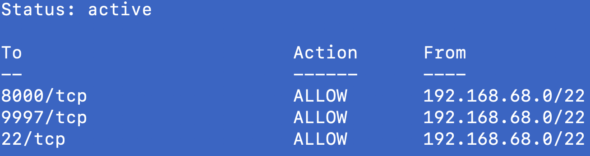
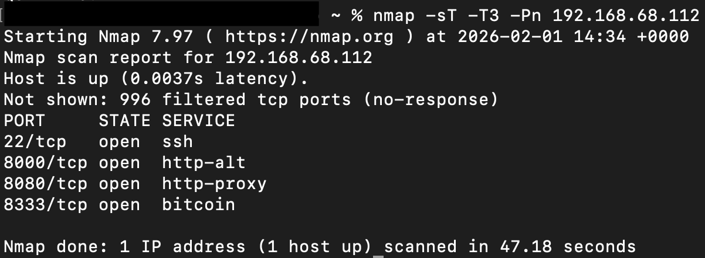
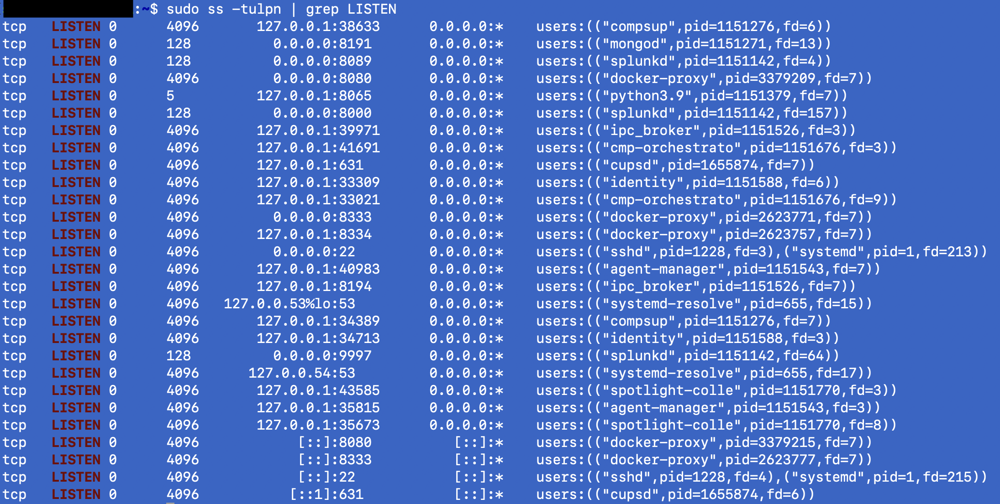

# Finding-001: UFW status doesn’t show Docker-published ports (netfilter/iptables is the effective ruleset)

Date: 31-01-2026
Host: "Son-of-Anton" - Desktop PC / Server (Ubuntu 24.04 LTS)
Category: Host firewall / Docker networking
Severity: Medium (unexpected attack surface)

## Summary
An Nmap scan and `sudo ss -tulpn | grep LISTEN` showed open ports that were not shown in `ufw status`. 

**Root cause:** Docker publishes ports by adding its own rules to the kernel firewall (netfilter via iptables), so `ufw status` alone does not reflect the full effective ruleset.

## Evidence

### 1) UFW view (appears locked down)
```bash
sudo ufw status
```


### 2) Nmap scan
```bash
nmap -sT -T3 -Pn 192.168.68.112
```
This baseline Nmap scan revealed additional open TCP ports that were not shown in ufw status (e.g., 8080/8333), indicating that UFW output alone doesn’t reflect all netfilter rules (e.g., Docker-published ports).



### 3) Host listening ports (shows additional exposed services)
```bash
sudo ss -tulpn | grep LISTEN
```


Interpretation:
- `docker-proxy` indicates Docker is forwarding a published container port to the host.
- These services can be reachable on the LAN even if `ufw status` does not list them.

## Root cause
- UFW is a management layer that writes firewall rules into the kernel firewall system (netfilter).
- Docker also writes firewall rules when ports are published (`-p` / compose `ports:`).
- Therefore, `ufw status` is not a complete representation of the effective firewall policy when Docker is present.
- The effective policy is the combined ruleset in iptables/netfilter (plus docker’s chains).

## Risk / Why it matters
- A user/admin may wrongly assume “only these UFW ports are open” and miss additional reachable services.
- This creates unexpected attack surface (scanning, brute force, service probing) against published container ports.

## Mitigation options (high-level)
1) Do not publish ports unless required (preferred for internal-only services like a practice DB).
2) If a port must exist, restrict scope (e.g., bind to localhost or restrict via DOCKER-USER chain).
3) Verify exposure using both host listening sockets (`ss`) and firewall rules (`iptables`), not only `ufw status`.

## What I implemented
My MariaDB container was listening on port 3306 because I initially set it up like this.

Goal: keep MariaDB running but prevent host port 3306 from listening on the LAN.    
Steps I took:
- Stopped the container
- Removed the container (volume preserved)
- Re-created the container WITHOUT publishing 3306

## Verification

### Host is not listening on 3306 anymore
```bash
sudo ss -tulpn | grep ':3306' || echo "3306 not listening on host"
```


## Notes / Next steps
- Decide which services should be LAN-accessible vs internal-only (publish only what is necessary).
- For any required published ports (e.g., Bitcoin 8333), consider whether to restrict scope with DOCKER-USER rules or binding strategies.
- Continue validating exposure with:
  - `nmap` from another host
  - `sudo ss -tulpn | grep LISTEN` on the server
  - `sudo iptables -S` / `sudo iptables -nvL DOCKER-USER`