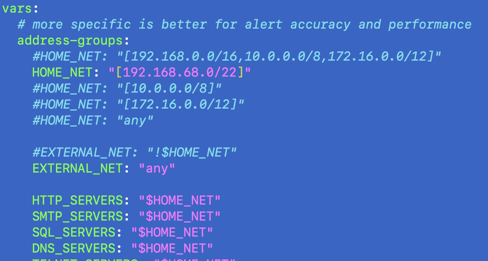

# Finding-002: Suricata default HOME_NET/EXTERNAL_NET settings suppress internal scan alerts in a lab

Date: 02-02-2026  
Host: "Son-of-Anton" / SOA - Desktop PC (Ubuntu)  
Category: Suricata configuration / detection visibility  
Severity: Low (lab config issue, not a security flaw)

## Summary
By default, Suricata is commonly configured so that `EXTERNAL_NET` effectively excludes `HOME_NET`.  
In a home lab, this can suppress scan signatures when the scanning traffic is **internal-to-internal** (LAN → LAN), because many rules are written to detect threats coming from “external” sources.

For Cyberlab testing, this meant internal Nmap-style scans did not reliably trigger **ET SCAN** alerts until the network variables were adjusted.

## Evidence
### 1) Config location
Suricata network variables are defined in:
- `/etc/suricata/suricata.yaml`

### 2) What I observed
- Internal scans from Cyberlab hosts initially did not generate the expected Suricata scan alerts.
- After adjusting the network variable logic to include internal traffic in the scope of detection, **ET SCAN** signatures began firing during the same style of tests.

**Screenshot**

## Root cause (why this happens)
- Many IDS rules are written with assumptions like: “attacker = external” and “protected assets = home network.”
- If `EXTERNAL_NET` is defined as “not HOME_NET” (or otherwise excludes internal ranges), then internal scans may not match the rule conditions.
- In a home lab, most testing is internal (Kali VM → SOA), so the default bias can hide the exact activity we’re trying to validate.

## What I changed (Cyberlab-specific)
Goal: allow Suricata scan signatures to trigger on **internal lab traffic** so detections + pipeline can be validated end-to-end.

High-level change:
- Adjusted the `EXTERNAL_NET` / `HOME_NET` variable logic in `suricata.yaml` so internal scanning traffic is not excluded from detection scope.

(Implementation note)
- This was done by editing the relevant lines in `suricata.yaml` (commenting/uncommenting the appropriate option).

## Why it matters
- Without this change, I could run scans in the lab and incorrectly conclude:
  - Suricata is broken, or
  - Splunk ingestion is broken, or
  - the ET SCAN rules “don’t work”
- With the change, internal scans generate alerts as expected, which makes the lab usable for detection validation.

## Notes / Next steps
- Treat this as a **lab testing configuration**, not a recommendation for every production setup.
- If I later add a proper network sensor position (SPAN/TAP/perimeter), I may revisit this to better align “external vs internal” semantics with a real environment.