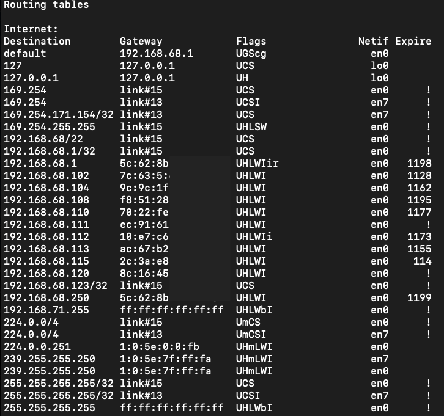
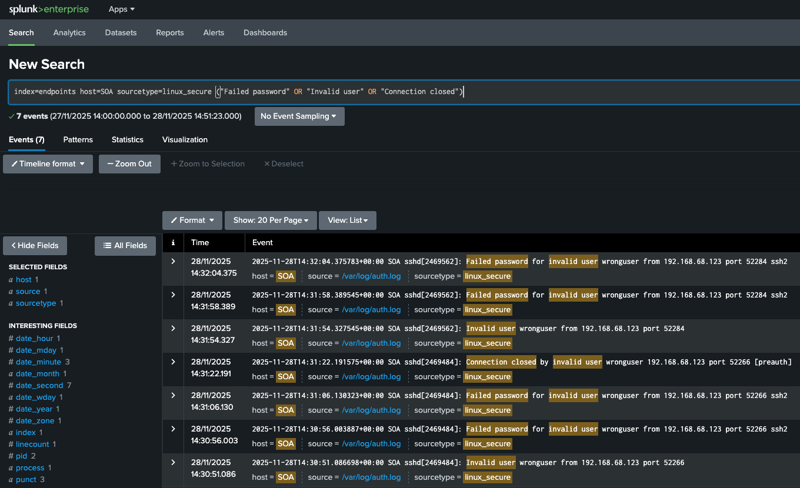

# Cyberlab Networking Fundamentals

This file is a simple record of the networking basics I inspected in my Cyberlab — things like packet behaviour, routing, and how my machines talk to each other.

## Table of Contents
1. [Routing Table (MacBook Pro)](#routing-table-macbook-pro)
2. [Network Segmentation](#network-segmentation-in-my-cyberlab)
3. [Packet → Log Correlation](#packet--log-correlation-ssh-authentication-failure)

---

## Routing Table (MacBook Pro)

This is the list of paths my MacBook uses to decide where outbound packets should go.  
It shows which traffic stays inside the LAN and which traffic gets forwarded through the router.

**Key entries:**
- **default → 192.168.68.1**  
  My TP-Link / Deco router. Anything that isn’t local goes through this gateway.

- **192.168.68/22 → link#15 (en0)**  
  My LAN — 192.168.68.x up to 192.168.71.x — is directly reachable over Wi-Fi.  
  No router needed; ARP resolves it.

- **127.0.0.1 → lo0**  
  Loopback. My machine talking to itself.

- **link#15**  
  macOS’s internal ID for the Wi-Fi interface.  
  Whenever this appears, it means: “Send directly over Wi-Fi.”

**Screenshot:**  

**Summary:**
Local traffic stays on Wi-Fi (ARP).  
Everything else goes to **192.168.68.1** for internet access.

---

## Network Segmentation in My Cyberlab

My home network doesn’t use formal VLANs yet, but it already has two logical tiers:

- **Main LAN** — trusted devices  
  (MacBook Pro, ThinkPad, server / Splunk host)

- **IoT LAN** — low-trust devices  
  (smart home devices, tablets, gaming consoles,...)

On the Deco mesh these appear as two separate networks. Behind the scenes they behave like two broadcast domains, keeping untrusted IoT devices away from machines that store logs, credentials, and security tools.

Later, when I switch to a managed switch, I’ll replace Deco’s isolation with real VLANs.

---

## Packet → Log Correlation (SSH Authentication Failure)

To test how network activity becomes SIEM logs, I generated a few **failed SSH login attempts** from my MacBook (192.168.68.123) to the SOA server.

### Wireshark View  
Saw the normal TCP handshake (SYN → SYN/ACK → ACK) followed by SSH negotiation.

**Screenshot:**

### Splunk View  
Searched:
`index=endpoints host=SOA sourcetype=linux_secure (“Failed password” OR “Invalid user” OR “Connection closed”)`

Splunk immediately showed the corresponding failed authentication logs, forwarded by the Universal Forwarder.

**Screenshot:**  

### End-to-end visibility path:
packet on the wire  
→ syslog on SOA  
→ forwarded by Splunk UF  
→ indexed in Splunk  
→ visible in search

---