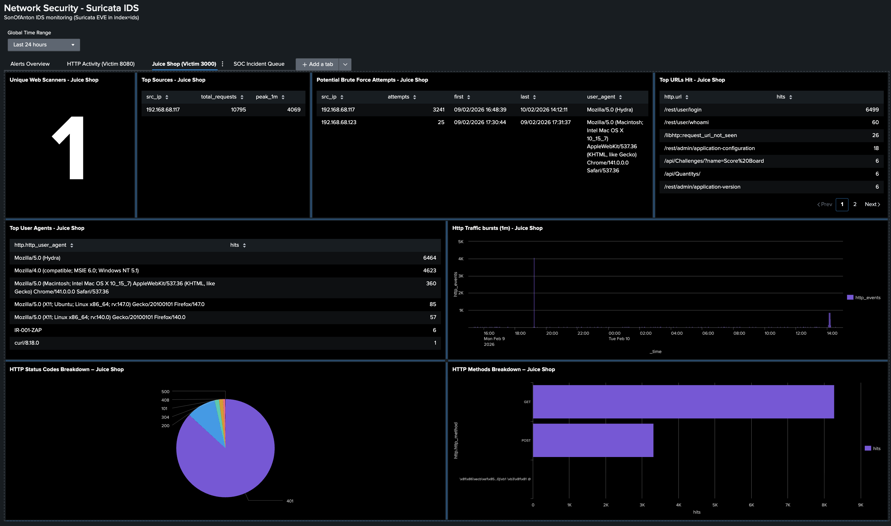

# IR-001 Brute Force Attempt Against OWASP Juice Shop Login (Hydra) — Detected via Splunk + Suricata

This report documents a **lab-simulated brute force-style login attempt** against **OWASP Juice Shop** (`/rest/user/login`) using **Hydra**.  
Detection was performed using **Suricata HTTP telemetry ingested into Splunk**, which triggered a custom Splunk alert.

This is **controlled test activity** in Cyberlab (not a real compromise).

---

## Environment

- Target: OWASP Juice Shop (`192.168.68.112:3000`)
- Sensor/SIEM: Son-of-Anton (SOA) (Suricata + Splunk)
- Data: Suricata `eve.json` → Splunk
- Splunk: `index=ids`, `sourcetype=suricata:eve`

---

## Summary of Activity

- Repeated failed login attempts were generated against:
  - Endpoint: `/rest/user/login`
  - Result: HTTP `401` responses
- Detection logic flagged **>=10 failures** within the search window.
- The alert triggered **twice** because the activity crossed into a second scheduled window.

Time window investigated:
- Start: `10/02/2026 14:04:38`
- End: `10/02/2026 14:12:11`
- Source IP: `192.168.68.117`

---

## Detection

Alert name:
- **ALERT-003 Juice Shop - Possible Brute Force (>=10 failed logins / 5m)**

What triggered it:
- Suricata HTTP events where:
  - `http.url="/rest/user/login"`
  - `http.status=401`
  - `attempts >= 10` (grouped by `src_ip`)

Why this matters:
- High-rate 401 failures to an auth endpoint is a common indicator of **password guessing / brute force** behaviour.
- In a real org, this would be correlated with **application auth logs** (accounts targeted, lockouts, MFA prompts).

---

## Evidence (Keep it lightweight)

Screenshots to include:
- Triggered alert(s):
  - `assets/ir_001_triggered_alerts.png`
- Splunk search results showing attempts + time bounds:
  - `assets/ir_001_splunk_stats_results.png`

Optional (only if useful for your screenshots):
- Dashboard panel showing the activity spike:
  - `assets/ir_001_dashboard_context.png`

---

## Attack Simulation (Lab)

Command used to generate the traffic:

```bash
hydra -l fake@juice.sh -P /usr/share/john/password.lst -t 1 -vV \
  192.168.68.112 http-post-form \
  "/rest/user/login:{\"email\"\:\"^USER^\"\,\"password\"\:\"^PASS^\"}:F=failed" \
  -s 3000
```

Notes:
- This test focuses on **network-visible symptoms** (HTTP 401 bursts), not payload inspection.
- Suricata did **not** raise a signature-based SQLi/XSS-style alert here; Splunk detected behaviour via thresholding.

---

## Triage (What I checked)

- Confirmed repeated `401` responses to `/rest/user/login` from a single source IP.
- Confirmed volume + window (to validate brute-force pattern):
  - Attempts: `3232` within `~ 7 minutes 30 seconds` (first: `10/02/2026 14:04:38`, last: `10/02/2026 14:12:11`)
- Checked for additional Suricata `event_type=alert` around the same time window:
  - Result: `none`
- Confirmed the activity aligns with automated login attempts:
  - User-Agent(s): `Mozilla/5.0 (Hydra)`

---

## Containment (Recommended / Not Performed in Lab)

This was **controlled lab activity**, so no blocking action was taken to avoid breaking normal lab traffic.

If this were a real incident, the immediate containment options would be:

- **Block (or rate-limit) the source IP** at the edge / host firewall (UFW on SOA or upstream router), to stop further attempts.
- **Temporarily lock the targeted account (or accounts)** (if supported) and force a password reset.
- **Increase authentication friction** (MFA, CAPTCHA, login throttling) to reduce brute-force feasibility.

---

## Next Steps (theory, not yet possible in my lab)

- Correlate this detection with application logs to identify targeted accounts and lockout behaviour.
- Extend detection to distinguish:
  - brute force (single account many passwords) vs password spraying (many accounts few passwords).

---

## Screenshots / Evidence


