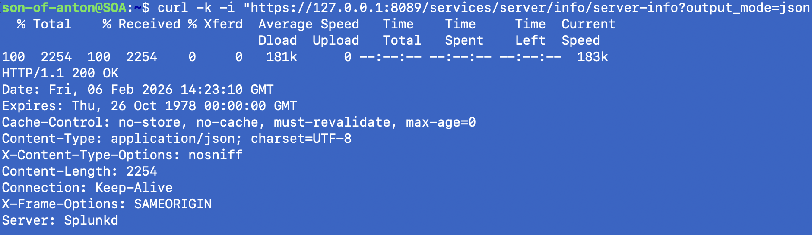

# VULN-001 — Nessus Finding: Splunk Information Disclosure Vulnerability (SP-CAAAP5E) (Fixed)

**Date:** 06-02-2026  
**Environment:** Cyberlab  
**Scanner:** Nessus Essentials (Kali VM)  
**Target:** SOA (192.168.68.112) — Splunk Enterprise 10.0.2  
**Service:** Splunkd management API (TCP 8089) — LAN-blocked by UFW

---

## 1) Summary
A Nessus Advanced Scan flagged SP-CAAAP5E / CVE-2018-11409 (info exposure). Validation confirmed that `/services/server/info/server-info` returned Splunk instance/system/license metadata **without authentication** when queried locally on `127.0.0.1:8089`. This was caused by `restmap.conf` stanzas explicitly setting `requireAuthentication = false`. I corrected the config, restarted Splunk, and re-tested to confirm the endpoint now requires auth.

---

## 2) Trigger
- Nessus Advanced Scan reported a **Medium** finding for Splunk information exposure (SP-CAAAP5E / CVE-2018-11409).

**Screenshot**


---

## 3) Investigation trail (how I got from Nessus → fix)
1) Nessus flagged SP-CAAAP5E / CVE-2018-11409 as an information exposure at a Splunk REST endpoint.
2) I verified the vendor context by reading Splunk’s security advisory for SP-CAAAP5E (published 2018) and cross-referenced the CVE entry (CVE-2018-11409) to confirm the scope and intended authentication behavior:
    - https://advisory.splunk.com/advisories/SP-CAAAP5E
    - https://www.cve.org/CVERecord?id=CVE-2018-11409
3) I then used Splunk’s REST API documentation to identify the relevant endpoints (`/services/server/info` and `server/sysinfo`) and determine how to query them:
    - https://help.splunk.com/en/splunk-enterprise/rest-api-reference/10.2/introspection-endpoints/introspection-endpoint-descriptions
4) I found Splunk support portal guidance that this issue can be caused by `restmap.conf` overriding authentication requirements for the `server-info` handler:
    - https://splunk.my.site.com/customer/s/article/Security-scan-indcates-a-Splunk-instance-affected-by-SP-CAAAP5E-after-upgrading-to-a-fixed-version
5) Based on that, I reviewed `/opt/splunk/etc/system/local/restmap.conf`, confirmed `requireAuthentication` was set to `false`, changed it to `true`, restarted Splunk, and re-tested to confirm `401 Unauthorized`.

---

## 4) Validation (what I proved)
**Unauthenticated response:**
- Validation command (local only, unauthenticated): `curl -k -i "https://127.0.0.1:8089/services/server/info/server-info?output_mode=json"`
- Result: `200 OK` with instance metadata (version/build, host identifiers, license fields, partial OS/hardware info)

**Scope check (LAN):**
- From Mac → SOA:8089 connection failed (UFW blocks 8089 inbound). Exposure was **local to SOA**, not reachable from other LAN hosts.

**Screenshot**



---

## 5) Root cause
Local Splunk override in:
- `/opt/splunk/etc/system/local/restmap.conf`

Stanzas were set to allow unauthenticated access:
```bash
`[admin:server-info] requireAuthentication = false`
`[admin:server-info-alias] requireAuthentication = false`
```
---

## 6) Remediation
Changed both settings to:
- `requireAuthentication = true`

Restarted Splunk to apply changes.

---

## 7) Post-fix proof
Re-test of the same endpoint (no credentials):
- Result: `401 Unauthorized` and `WWW-Authenticate: Basic realm="/splunk"`

**Screenshot**


---

## 8) Notes
Splunk’s advisory states versions 6.6.0+ expose this endpoint only to authenticated users; however, local configuration can override that behavior. This exercise shows why vendor advisories + live validation + config review matter.