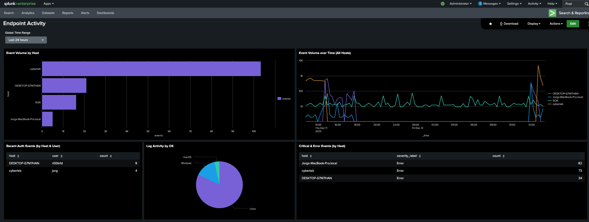

# Endpoint Activity Dashboard (Splunk Dashboard Studio)

This dashboard provides a consolidated view of endpoint telemetry across all devices currently monitored within the Cyberlab environment (MacBook Pro, ThinkPad Linux workstation “cyberlab”, and the Desktop PC Ubuntu server “SOA”).

It was designed with one primary goal:

## Endpoint Telemetry Verification
This dashboard confirms that the Universal Forwarders on each endpoint are forwarding the expected logs, that sourcetypes are being parsed correctly, and that Splunk is consistently ingesting system events.
Because the Cyberlab endpoints run different operating systems (macOS, Ubuntu Linux, and Windows (dual boot on the ThinkPad)), this dashboard acts as a cross-platform ingestion check. It verifies that core logs are flowing properly.
If ingestion breaks, timestamps drift, or Universal Forwarder stanzas misbehave, the affected host becomes immediately obvious in this dashboard.
This is the first endpoint-focused dashboard created for the Cyberlab and serves as a baseline for future security-oriented dashboards.
It is not designed as a threat-detection or SOC response dashboard yet.

---

## Data Sources Used in This Dashboard

Logs feeding this dashboard come from these sourcetypes:

**ThinkPad Linux Workstation (“cyberlab”) & Desktop PC - Linux Server (“SOA”)**
- syslog
- linux_secure
- kern
- auth-too_small

**MacBook Pro (“Jorgs-MacBookPro.local”):**  
- macos_system
- macos_install
- The MacBook is intentionally excluded from the authetication panel until proper normalization is implemented.

---

## Screenshot



---

# Dashboard Panels

## 1. Event Volume by Host — *Visualization: Horizontal Bar Chart*

### SPL Used:
```bash
index=endpoints
| stats count as events by host
| sort - events
```

```index=endpoints``` – Search only within the endpoints index, where all Linux, macOS, and SOA system logs are ingested.  
```| stats count as events by host``` – Group all events by the host field and calculate how many logs each endpoint produced.  
```| sort - events``` – Sort hosts in descending order so the highest-volume machines appear first.  

### Purpose:
Provides a high-level comparison of total log volume per endpoint over the selected time range.
This panel is mainly used to:  
- see which hosts are generally generating more or fewer events than others
- confirm that each expected endpoint is present in the data set and producing some logs
- give a quick “big picture” view of relative activity levels between machines (e.g. SOA vs cyberlab vs MacBook)  
- Because this panel shows summarised counts only, it is not intended to detect sudden spikes or “hosts going quiet” in real time

---

## 2. Event Volume Over Time (All Hosts) — *Visualization: Multi-Series Line Chart*

### SPL Used:
```bash
index=endpoints
| timechart span=15m count by host
```
```| timechart``` – Converts raw events into a time-series suitable for line-chart visualisation.  
```span=15m``` – Buckets events into 15-minute intervals, smoothing the data and reducing noise while still showing meaningful changes over time.  
```count by host``` – Produces one time-series line per host, allowing direct comparison of log activity between machines.

### Purpose:
Provides a real-time behavioural view of each endpoint by showing how log activity changes over time.  
This panel reveals:
- when a host is online, offline, asleep, or disconnected
- whether a Universal Forwarder is sending logs continuously or batching after reconnect
- sudden bursts of log activity (e.g., errors, restarts, system instability)
- quiet periods where a host stops producing events (e.g. endpoint shut down)
- baseline activity patterns for each endpoint throughout the day  


```timechart``` makes this panel the true “heartbeat” of the dashboard — it shows when each host is active, how it behaves across time, and where anomalies or drop-offs occur. This is the most accurate panel for detecting uptime issues, log-forwarding interruptions, or abnormal activity patterns.

---

## 3. Recent Authentication Events (by Host & User) — *Visualization: Table*

### SPL Used:
```bash
index=endpoints host!="Jorgs-MacBookPro.local"
(
    source="/var/log/auth.log"
    OR sourcetype=linux_secure
    OR sourcetype=auth-too_small
    OR (
        sourcetype="WinEventLog:Security"
        Logon_Type=2
        (
            (EventCode=4624 AND Virtual_Account="No" AND Elevated_Token="Yes")
            OR EventCode=4625
        )
    )
)
| eval user = coalesce(user, mvindex(Account_Name, 1))
| stats count by host, user
| sort - count
```

```host!=“Jorgs-MacBookPro.local”``` – Excludes the MacBook Pro due to a known macOS logging issue that generates duplicate and overly noisy auth-related events, which would distort this panel. Will try to find a solution for this.  
```source=”/var/log/auth.log”``` – Captures native Linux authentication activity from PAM and SSH subsystems.  
```sourcetype=linux_secure``` – Includes additional Linux security/authentication logs depending on distribution and UF parsing.  
```sourcetype=auth-too_small``` – Required because Splunk classifies short PAM messages (session opens/close events) under this sourcetype; without it, a significant portion of Linux auth activity would be missing.  
```sourcetype=“WinEventLog:Security”``` – Captures Windows authentication activity.  
```Logon_Type=2``` - Restricts Windows events to interactive logons only. This filters out background service logons, scheduled tasks, and network-based authentication events that are not user-driven.  
```EventCode=4624 AND Virtual_Account=“No” AND Elevated_Token=“Yes”``` - Identifies successful interactive user logins on Windows.
This combination filters out machine accounts, system-generated sessions, and non-user logon noise.  
```EventCode=4625``` - Includes failed interactive login attempts on Windows, allowing both successful and failed user authentication attempts to be represented in the same panel.  
```| eval user = coalesce(user, mvindex(Account_Name, 1))``` - Normalises user identity across operating systems:
- On Linux, the user field already exists and is preserved.
- On Windows, Account_Name is a multi-value field containing both machine and user accounts.
- ```mvindex(Account_Name, 1)``` extracts the actual human user.
- ```coalesce()``` ensures a single unified user field is populated for all events.  

This step is essential to prevent duplicate rows and incorrect counts caused by Windows multi-value account fields.


```| stats count by host, user``` – Groups authentication events by host and user, producing a summary of login-related activity.  
```| sort - count``` – Orders results by highest activity first.

### Purpose:
This panel provides a clean, cross-platform view of real user authentication activity across Linux and Windows endpoints *excluding macOS for the time being.*  
This panel helps identify:
- which users are logging into which machines
- relative authentication activity per endpoint
- whether Linux and Windows auth logs are being forwarded correctly


By tightly filtering Windows events and normalising user identity across operating systems, this panel avoids the misleading duplication and noise common in raw authentication logs. Because Splunk classifies many Linux PAM events under the auth-too_small sourcetype, including it was essential to avoid missing session opens/closures and other short authentication records.   
The MacBook Pro is intentionally excluded until its macOS unified logging can be normalised, as its duplicated and aggregated auth messages overwhelm the Linux telemetry and produce misleading results.

---

## 4. Log Activity by OS — *Visualization: Pie Chart*

### SPL Used:
```bash
index=endpoints
| stats count by host
| eval os_type = case(
    host="SOA" OR host="cyberlab", "Linux",
    host="Jorgs-MacBook-Pro.local", "macOS",
    host="DESKTOP-GM7MHAN", "Windows",
    1=1, "Unknown"
)
| stats sum(count) as count by os_type
```

```| stats count by host``` – Counts total events generated by each host. This gives one aggregated value per machine.  
```| eval os_type = case(…)``` – Manually maps each host to its corresponding operating system.  
```host="SOA" OR host="cyberlab"``` → Linux endpoints  
```host="Jorgs-MacBook-Pro.local"``` → macOS endpoint  
```host="DESKTOP-GM7MHAN"``` → Windows endpoint  
```1=1, "Unknown"``` → Catch-all fallback to ensure no host is excluded even if not explicitly mapped  
```| stats sum(count) as count by os_type``` – Aggregates total events per OS category, producing one row per operating system.  

### Purpose of This Panel
Shows the distribution of endpoint operating systems within the Cyberlab based on the volume of logs each OS type produces.  
Since the Universal Forwarder does not natively provide an “os” field and macOS/Linux telemetry does not expose OS metadata in a consistent way, manual mapping was required.  

This panel helps:
- provide a basic overview of environment composition
- support future dashboards where filtering by OS may be necessary  


While not intended as a security metric, this pie chart serves as a simple environment inventory check and will be useful when building more advanced OS-specific searches later.

---

## 5. Critical & Error Events (by Host) — *Visualization: Table*

### SPL Used:
```bash
index=endpoints
(
    sourcetype=syslog
    OR sourcetype=kern
    OR sourcetype=linux_secure
    OR sourcetype=macos_system
    OR sourcetype=macos_install
    OR sourcetype="WinEventLog:System"
    OR sourcetype="WinEventLog:Application"
)
| eval severity_label = case(
      sourcetype LIKE "WinEventLog:%" AND Level=1, "Critical",
      sourcetype LIKE "WinEventLog:%" AND Level=2, "Error",
      searchmatch("error"), "Error",
      1=1, null()
)
| search severity_label=*
| stats count by host, severity_label
| sort - count host
```

```sourcetype=…``` – Includes standard system and kernel logs from Linux, macOS unified logs, macOS install logs, and Windows System/Application event logs. This guarantees that common error messages and warnings from all supported operating systems are considered.  
```| eval severity_label = case(…)``` – Assigns a severity classification based on event source:  
- ```Windows Level=1``` → Critical (native Windows critical classification)
- ```Windows Level=2``` → Error
- ```searchmatch(“error”)``` → Error for Linux/macOS system logs
-	```1=1, null()``` ensures events without an assigned severity are dropped later  

```| search severity_label= *``` – Filters out events that did not match any severity classification.  
```| stats count by host, severity_label``` – Counts how many Critical and Error events each host produced.  
```| sort - count host``` – Displays the hosts with the highest number of severe events first.  

### Purpose:
Provides a high-level summary of system stability and error conditions across all endpoints.  
This panel helps identify:
- hosts experiencing repeated system or application errors
- Windows machines generating true Critical events (via Level=1)
- Linux/macOS hosts generating frequent error messages in system logs
- early indicators of misconfigurations, crash loops, or service failures
- endpoints that may require investigation due to unusually high error volume

This classification intentionally avoids flagging Linux/macOS messages containing generic "critical" text (which often appears in non-fatal driver output), and instead relies on trusted severity signals:

- Windows event levels
- Explicit "error" matches in Linux/macOS logs


The result is a clean, reliable view of meaningful system problems without false positives.
