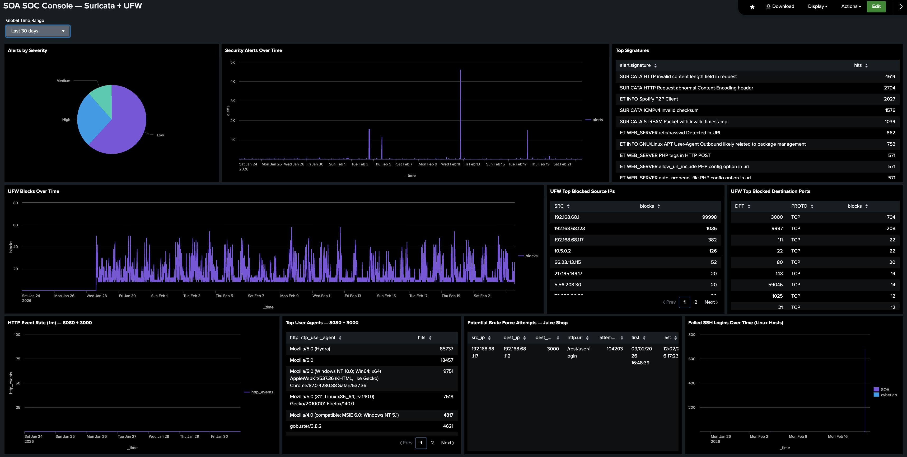

# SOA SOC Console — Suricata + UFW (Splunk Dashboard Studio)

This dashboard is a SOC-style console for **SOA** in Cyberlab, combining **Suricata on SOA** (host-based network monitoring of traffic visible to SOA’s capture interface) and **UFW on SOA** (host firewall blocks).

It’s built to do three things:

- **Summarise SOA security activity at a glance** (alerts by severity, spikes over time, top signatures)
- **Highlight top offenders and targets** (noisiest source IPs, most-hit destination ports, HTTP endpoints/user agents)
- **Support fast triage** by viewing Suricata detections alongside UFW blocks on the same host

Scope: visibility is **SOA-centric** (traffic to/from SOA), not full-network monitoring.

---

## Data Source Used in This Dashboard

SOA (Server / Ubuntu) — Suricata + UFW logs forwarded into Splunk

- **Suricata**
  - Index: `ids`
  - Sourcetype: `suricata:eve`

- **UFW**
  - Index: `endpoints`
  - Sourcetype: `ufw`

---

# Dashboard Panels

**Screenshot**



## 1. Alerts by Severity — Visualization: Pie Chart

SPL Used:
```bash
    index=ids event_type=alert
    | eval sev=tonumber(coalesce('alert.severity','alert.metadata.severity'))
    | eval severity=case(sev==1,"High", sev==2,"Medium", sev==3,"Low", true(),"Unknown")
    | stats count as alerts by severity
    | sort - alerts
```

- `index=ids event_type=alert` - Searches Suricata **alert** events in the `ids` index (events where Suricata raised a detection).
- `| eval sev=tonumber(coalesce('alert.severity','alert.metadata.severity'))` - Normalises severity into one numeric field:
  - `coalesce(...)` selects the first available severity field (Suricata can store it in different locations)
  - `tonumber(...)` ensures it’s numeric for reliable comparison

- `| eval severity=case(sev==1,"High", sev==2,"Medium", sev==3,"Low", true(),"Unknown")` - Maps Suricata severity values into readable labels:
  - `1 → High`
  - `2 → Medium`
  - `3 → Low`
  - anything else → `Unknown`

- `| stats count as alerts by severity` - Counts the number of Suricata alerts per severity bucket.

- `| sort - alerts` - Sorts so the most common severity appears first.

**Purpose:**
Provides a quick severity distribution view of Suricata detections on **SOA**, so you can immediately see whether activity is mostly low-severity noise or includes higher-severity alerts worth pivoting into.


## 2. Security Alerts Over Time — Visualization: Line Chart

SPL Used:
```bash
    index=ids event_type=alert
    | timechart span=5m count as alerts
```
- `index=ids event_type=alert` - Searches Suricata **alert** events in the `ids` index (events where Suricata raised a detection).

- `| timechart span=5m count as alerts` - Buckets the alert events into **5-minute intervals** and counts how many alerts occurred in each bucket.
  - `span=5m` = each data point represents a 5-minute window
  - `count as alerts` = the number of alert events in that window

**Purpose:**
Shows alert activity as a timeline so spikes are obvious. This is useful for quickly identifying **bursts of scanning, probing, or web attack activity** against SOA and then pivoting into the “Top Signatures” and “Top Sources/Ports” panels to understand what caused the spike.

## 3. Top Signatures — Visualization: Table

SPL Used:
```bash
    index=ids event_type=alert
    | stats count as hits by alert.signature
    | sort - hits
    | head 10
```
- `index=ids event_type=alert` - Searches Suricata **alert** events in the `ids` index.

- `| stats count as hits by alert.signature` - Groups alerts by `alert.signature` (the Suricata rule / signature name) and counts how many times each signature fired.

- `| sort - hits` - Sorts so the most frequently triggered signatures appear first.

- `| head 10` - Limits output to the top 10 signatures for readability.

**Purpose:**
Highlights which Suricata rules are firing most often against SOA in the selected time range. This is a fast pivot for understanding *what type of activity is dominating* (e.g., scan signatures, web attack signatures, policy violations) and deciding which signature(s) to investigate first.

## 4. UFW Blocks Over Time — Visualization: Line Chart

SPL Used:
```bash
    index=endpoints "UFW BLOCK"
    | timechart span=5m count as blocks
```
- `index=endpoints "UFW BLOCK"` - Searches firewall log events in the `endpoints` index that contain the string `UFW BLOCK` (UFW deny entries).
- `| timechart span=5m count as blocks` - Buckets matching UFW block events into **5-minute intervals** and counts how many blocks occurred in each bucket.
  - `span=5m` = each point is a 5-minute window
  - `count as blocks` = number of UFW block log entries in that window

**Purpose:**
Shows firewall block activity as a timeline so bursts stand out immediately. This panel is useful for corroboration: if Suricata alert volume spikes, I can check whether SOA’s firewall also saw a matching increase in blocked traffic during the same time window.

## 5. UFW Top Blocked Source IPs — Visualization: Table

SPL Used:
```bash
    index=endpoints "UFW BLOCK"
    | stats count as blocks by SRC
    | sort - blocks
    | head 15
```


- `| stats count as blocks by SRC` - Groups blocked events by `SRC` (source IP address from the UFW log line) and counts how many blocks each source generated.

- `| sort - blocks` - Sorts so the noisiest blocked sources appear first.

- `| head 15` - Limits output to the top 15 source IPs for readability.

**Purpose:**
Identifies the most active blocked source IPs hitting SOA. This is a fast way to spot noisy scanners or repeated probing from a single host and provides an immediate pivot into port-focused panels (what they targeted) or Suricata alerts (what signatures fired from the same source).

## 6. UFW Top Blocked Destination Ports — Visualization: Table

SPL Used:
```bash
    index=endpoints "UFW BLOCK"
    | stats count as blocks by DPT PROTO
    | sort - blocks
    | head 10
```
- `index=endpoints "UFW BLOCK"` - Searches firewall log events in the `endpoints` index that contain the string `UFW BLOCK` (UFW deny entries).

- `| stats count as blocks by DPT PROTO` - Groups blocked events by:
  - `DPT` = destination port that was targeted
  - `PROTO` = protocol used (typically `TCP` or `UDP`)  
  Then counts how many blocks occurred for each (port + protocol) combination.

- `| sort - blocks` - Sorts so the most frequently targeted blocked ports appear first.

- `| head 10` - Limits output to the top 10 destination port/protocol combinations for readability.

**Purpose:**
Shows which ports are being targeted most often and actually being blocked by UFW on SOA. This is useful for quickly spotting scan/probe patterns (e.g., bursts across common service ports) and for correlating with Suricata signatures to understand whether the traffic is simple recon or exploit/probing activity.

## 7. HTTP Event Rate (1m) — 8080 + 3000 — Visualization: Line Chart

SPL Used:
```bash
    index=ids event_type=http (dest_port=8080 OR dest_port=3000)
    | timechart span=1m count as http_events
```
- `index=ids event_type=http (dest_port=8080 OR dest_port=3000)` - Searches Suricata **HTTP** events in the `ids` index, restricted to traffic destined for:
  - `8080` (Victim 8080 web target)
  - `3000` (OWASP Juice Shop / Victim 3000)

- `| timechart span=1m count as http_events` - Buckets HTTP events into **1-minute intervals** and counts how many occurred per minute.
  - `span=1m` = higher resolution timeline for web activity
  - `count as http_events` = number of Suricata HTTP events per minute

**Purpose:**
Shows web activity volume over time for the two main HTTP targets on SOA (8080 and 3000). This makes it easy to spot bursts caused by scanning, automated probing, or active testing (e.g., ZAP-style traffic) and then pivot into HTTP-focused panels (paths, user agents, source IPs) to identify what drove the spike.

## 8. Top User Agents — 8080 + 3000 — Visualization: Table

SPL Used:
```bash
    index=ids event_type=http (dest_port=8080 OR dest_port=3000)
    | stats count as hits by http.http_user_agent
    | sort - hits
    | head 15
```
- `index=ids event_type=http (dest_port=8080 OR dest_port=3000)` - Searches Suricata HTTP events for the two SOA web targets:
  - `8080` (Victim 8080)
  - `3000` (OWASP Juice Shop / Victim 3000)

- `| stats count as hits by http.http_user_agent` - Groups events by `http.http_user_agent` (the client User-Agent string) and counts how many requests each UA generated.

- `| sort - hits` - Sorts so the most common user agents appear first.

- `| head 15` - Limits output to the top 15 user agents for readability.

**Purpose:**
Shows which client user agents are generating the most HTTP traffic against the two SOA web targets. This is a useful triage pivot because automated tools and scanners often have distinctive user agents (or unusual missing/blank values), making it easier to separate normal browsing from scripted probing and attack tooling.

## 9. Potential Brute Force Attempts — Juice Shop — Visualization: Table

SPL Used:
```bash
    index=ids event_type=http dest_port=3000 http.url="/rest/user/login"
    | stats 
        count as attempts
        earliest(_time) as first
        latest(_time) as last
        values(http.http_user_agent) as user_agents
        values(src_port) as src_ports
      by src_ip dest_ip dest_port http.url
    | where attempts>=10
    | eval first=strftime(first,"%d/%m/%Y %H:%M:%S"), last=strftime(last,"%d/%m/%Y %H:%M:%S")
    | eval user_agents=mvjoin(user_agents," | "), src_ports=mvjoin(src_ports,", ")
    | table src_ip dest_ip dest_port http.url attempts first last src_ports user_agents
    | sort - attempts
```
- `index=ids event_type=http dest_port=3000 http.url="/rest/user/login"` - Searches Suricata HTTP events destined for **Juice Shop (SOA:3000)** and restricted to the login endpoint `/rest/user/login`.

- `| stats ... by src_ip dest_ip dest_port http.url` - Aggregates events into one row per source IP (per destination/URL) and calculates:
  - `attempts` = number of login requests in the time range
  - `first` / `last` = first and last timestamps in the burst
  - `user_agents` = user-agent strings observed (useful for spotting automated tooling)
  - `src_ports` = source ports observed (often changes during rapid automated traffic)

- `| where attempts>=10` - Applies the detection threshold: show only sources generating **10+ login requests** within the dashboard time window (typically aligned to a 5-minute view for brute-force-style bursts).

- `| eval first=strftime(...), last=strftime(...)` - Formats timestamps into UK datetime format for readability.

- `| eval user_agents=mvjoin(...), src_ports=mvjoin(...)` - Joins multi-value user-agents and source ports into readable strings.

- `| table ...` - Limits output to the key triage fields shown in the panel.

- `| sort - attempts` - Shows the noisiest sources first.

**Purpose:**
Surfaces potential brute-force / password-guessing behaviour against Juice Shop by flagging **high-rate login endpoint activity** from a single `src_ip`. This panel is designed for quick triage: identify the source, confirm the burst window, and spot automation hints via user-agent patterns.
