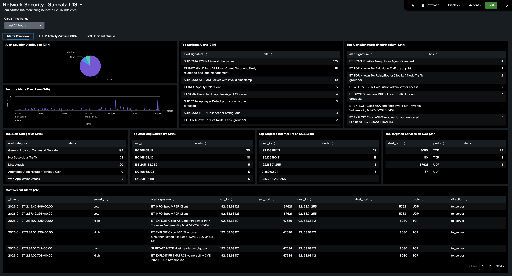
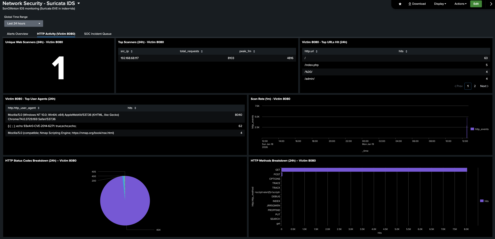
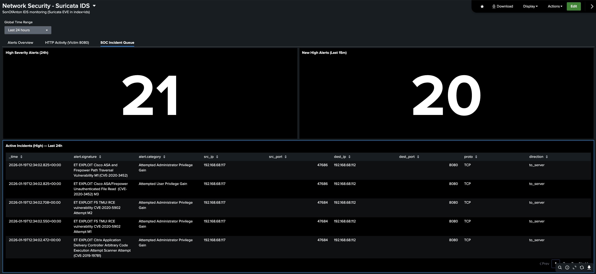

# Network Security - Suricata IDS Dashboard (Splunk Dashboard Studio)

This dashboard monitors Suricata IDS telemetry inside the Cyberlab.

## Related Documentation (Prerequisite)

This dashboard assumes Suricata is already installed and forwarding EVE JSON events into Splunk.

Suricata setup and forwarding documentation:
- [Suricata IDS Setup (EVE → Splunk)](setup/suricata-ids-setup.md)

---

It was created for two specific purposes:

## 1. IDS Alert Visibility (Triage View)

To provide a fast, analyst-friendly overview of Suricata alerts over the last 24 hours, including:
- severity distribution
- alert volume over time
- most common Suricata alert signatures
- highest severity alert signatures (High/Medium)
- top alert categories
- top attacking source IPs
- top targeted internal IPs on SOA
- top targeted services (ports + protocol) on SOA
- a “Most Recent Alerts” table for immediate event context

This dashboard is not trying to be a full SIEM correlation engine yet.
It is a clear Suricata alert view that lets me triage what is happening in the lab quickly.

## 2. Practical Web Attack Visibility (Victim 8080)

To give a dedicated view of HTTP scanning activity against the lab victim service on port 8080, including:
- unique scanners
- top scanners (requests + peak rate)
- top URLs hit
- top user agents
- scan rate over time
- HTTP status code breakdown
- HTTP method breakdown

This makes it easy to validate that scans are actually hitting the victim service and that Suricata is capturing the activity.

---

## Dashboard Structure (Tabs)

This dashboard is split into three tabs:

- **Alerts Overview**    
    The main Suricata alert triage view (severity, categories, signatures, top IPs/ports, recent alerts).

- **HTTP Activity (Victim 8080)**    
    Focused web-traffic scanning view for the victim service running on port 8080.

- **SOC Incident Queue**    
    A high-severity queue view:
    - High severity alerts (24h)
    - New high alerts (last 15m)
    - Active incidents table (High) with signature/category + network context

---

## Data Source Used in This Dashboard


Ubuntu Server / Desktop PC ("SOA") - Suricata IDS Node

- **Index:** `ids`
- **Sourcetype:** `suricata:eve`
- **Source path:** `/var/log/suricata/eve.json`

Suricata writes EVE JSON events to `/var/log/suricata/eve.json`.
Splunk Enterprise on SOA ingests this file locally (monitor input).

---    

# Dashboard Panels

This dashboard is split into three tabs. Each tab groups panels by investigation workflow.

## Tab 1 — Alerts Overview

Each panel in this tab summarises Suricata IDS alerts and provides fast triage context for the last 24 hours.

**Screenshot**    



### 1. Alerts Severity Distribution (24h) — Visualization: Pie Chart

SPL Used:
```bash
index=ids event_type=alert
| spath path=alert.severity output=sev
| eval sev=tonumber(sev)
| eval severity_label=case(
        sev==1,"High",
        sev==2,"Medium",
        sev==3,"Low",
        isnull(sev),"Missing",
        true(),"Other"
    )
| stats count as hits by severity_label
| sort - hits
```
- `index=ids event_type=alert` - Search Suricata alert events in the ids index. This excludes non-alert Suricata event types (for example DNS, HTTP, flow records) and focuses only on IDS alerts.
- `| spath path=alert.severity output=sev` - Extract the JSON field alert.severity from the Suricata EVE event and store it as sev.
- `| eval sev=tonumber(sev)` - Convert sev into a numeric value so it can be compared reliably in the case() logic.
- `| eval severity_label=case(...)` - Map Suricata severity numbers to readable labels:
  - 1 → High
  - 2 → Medium
  - 3 → Low    

  Also handles edge cases:
  - Missing if the severity field is not present
  - Other for unexpected values (future-proofing / malformed events)

- `| stats count as hits by severity_label` - Count how many alerts occurred for each severity label.
- `| sort - hits` - Sort results so the most frequent severity appears first.

Purpose:
Shows the current severity distribution of Suricata alerts. This is the fastest “how bad is it right now?” panel in the dashboard. A sudden increase in High alerts is an immediate signal to pivot into the “Most Recent Alerts” table and top signatures/categories panels for context.

Note:   
Splunk already extracts Suricata EVE JSON fileds (e.g. `alert.severity`), so `spath` is optional and only used where helpful for readability.

### 2. Security Alerts Over Time (24h) — Visualization: Line Chart

SPL Used:
```bash
index=ids event_type=alert
| timechart span=5m count as alerts
```
- `| timechart span=5m count as alerts` - Convert events into a time-series chart:
  - span=5m buckets alerts into 5-minute intervals
  - count counts how many alert events occurred per bucket as alerts names the series alerts

Purpose:
Shows alert volume over time so you can spot spikes, sustained scanning, and quiet periods. A sudden peak is a cue to pivot into “Most Recent Alerts” and the top signatures/source IP panels around the same time window to identify what caused it.

### 3. Top Suricata Alerts (24h) — Visualization: Table

SPL Used:
```bash
index=ids event_type=alert
| stats count as hits by alert.signature
| sort - hits
| head 10
```
- `| stats count as hits by alert.signature` - Group alerts by the Suricata signature name (alert.signature) and count how many times each signature fired.
- `| sort - hits` - Sort signatures so the most frequent alerts appear first.
- `| head 10` - Keep only the top 10 signatures by alert volume.

Purpose:
Shows which Suricata signatures are firing the most. This is my “what’s dominating the noise right now?” panel, and it helps quickly identify the most common activity type in the lab (for example repeated scanner behaviour, service probes, or exploit attempts).


### 4. Top Alert Signatures (High/Medium) (24h) — Visualization: Table

SPL Used:
```bash
index=ids event_type=alert ('alert.severity'=1 OR 'alert.severity'=2)
| stats count as hits by alert.signature
| sort - hits
| head 10
```
- `('alert.severity'=1 OR 'alert.severity'=2)` - Filter to higher-priority alerts only.
- `| stats count as hits by alert.signature` - Count how many times each signature fired within the filtered High/Medium set.
- `| sort - hits` - Sort so the most frequent High/Medium signatures appear first.
- `| head 10` - Keep only the top 10.

Purpose:
Highlights the most common higher-severity signatures, so you can focus triage on what Suricata considers more serious activity. This is usually the quickest “priority list” panel before you pivot into recent events for raw context.


### 5. Top Alert Categories (24h) — Visualization: Table

SPL Used:
```bash
index=ids event_type=alert
| stats count as alerts by alert.category
| sort - alerts
| head 10
```
- `| stats count as alerts by alert.category` - Group alerts by Suricata category (alert.category) and count how many alerts fall into each category.
- `| sort - alerts` - Sort categories so the most frequent categories appear first.
- `| head 10` - Keep only the top 10 categories.

Purpose:
Shows which alert categories dominate in the last 24 hours. Categories are useful for quick triage because they describe the broad type of detection (for example policy violations, scanning behaviour, or exploit-related detections) without needing to read every signature.


### 6. Top Attacking Source IPs (24h) — Visualization: Table

SPL Used:
```bash
index=ids event_type=alert
| stats count as alerts by src_ip
| sort - alerts
| head 10
```
- `| stats count as alerts by src_ip` - Group alerts by src_ip (source IP address) and count how many alerts each source generated.
- `| sort - alerts` - Sort so the sources with the highest alert counts appear first.
- `| head 10` - Keep only the top 10 source IPs.

Purpose:
Identifies the most active alert-generating source IPs in the last 24 hours. This is my fastest “top talker” view for attacker/scanner origin, and it’s a common pivot point for deeper analysis (for example: what signatures did this source trigger, and which internal services did it target?).


### 7. Top Targeted Internal IPs on SOA (24h) — Visualization: Table

SPL Used:
```bash
index=ids event_type=alert direction=to_server
| stats count as alerts by dest_ip
| sort - alerts
| head 15
```
- `index=ids event_type=alert direction=to_server` - Search Suricata alert events in the ids index and filter to traffic where Suricata classified the flow direction as to the server.
This focuses the view on inbound “targeted” activity rather than client-originated traffic.
- `| stats count as alerts by dest_ip` - Group alerts by destination IP (dest_ip) and count how many alerts each internal target received.
- `| sort - alerts` - Sort so the most-targeted internal IPs appear first.
- `| head 15` - Keep the top 15 destination IPs.

Purpose:
Shows which internal systems are being targeted most often (from Suricata’s perspective) over the last 24 hours. This highlights any unexpected internal destinations that are receiving alert-heavy traffic.


### 8. Top Targeted Services on SOA (24h) — Visualization: Table

SPL Used:
```bash
index=ids event_type=alert direction=to_server
| stats count as alerts by dest_port proto
| sort - alerts
| head 15
```
- `| stats count as alerts by dest_port proto` - Group alerts by destination port and protocol (dest_port + proto) and count how many alerts were associated with each service.
- `| sort - alerts` - Sort so the most-targeted port/protocol combinations appear first.
- `| head 15` - Keep the top 15 targeted services.

Purpose:
Shows which services are being targeted most frequently (ports + protocol) over the last 24 hours. This is a quick way to confirm what the lab is being probed for (for example web ports, SSH, SMB, or other exposed services) and where alert volume is concentrating.


### 9. Most Recent Alerts (24h) — Visualization: Table

SPL Used:
```bash
index=ids event_type=alert
| eval sev_num='alert.severity'
| eval severity=case(sev_num==1,"High", sev_num==2,"Medium", sev_num==3,"Low", true(),"Other")
| table _time severity alert.signature src_ip src_port dest_ip dest_port proto direction
| sort - _time
| head 20
```
- `| eval sev_num='alert.severity'` - Create a local field sev_num from the Suricata severity value.    

Note: this relies on alert.severity already being extracted into a Splunk field.

- `| eval severity=case(...)` - Convert the numeric severity into a readable label:
  - 1 → High
  - 2 → Medium
  - 3 → Low
  - anything else → Other    

- `| table _time severity alert.signature src_ip src_port dest_ip dest_port proto direction` - Select the key triage fields and present them as a clean table:
  - when it happened (_time)
  - severity and signature (what fired)
  - source/destination IP + port (who talked to who)
  - protocol + flow direction    

- `| sort - _time` - Sort newest alerts first.
- `| head 20` - Show the most recent 20 alerts.

Purpose:
This is the main “analyst context” panel. It provides immediate, readable details for the latest alerts so I can quickly understand what happened and decide where to pivot next (for example: inspect a specific source IP, signature, destination port, or direction).


## Tab 2 — HTTP Activity (Victim 8080)

Each panel in this tab focuses on HTTP scanning activity against the lab victim service on port 8080.
The goal is to make automated scanning and exploit-style behaviour obvious using simple, readable summaries (scanners, URLs, user agents, request rates, status codes, and methods).

Note:
The victim HTTP service on port 8080 is provided by an NGINX instance running on SOA.
This service exists purely to generate realistic web traffic and scanning activity for Suricata + Splunk visibility.

**Screenshot**    




### 1. Unique Web Scanners (24h) — Victim 8080 — Visualization: Single Value

SPL Used:
```bash
index=ids event_type=http dest_port=8080
| bin _time span=1m
| stats count as http_requests by _time src_ip
| where http_requests > 300
| stats dc(src_ip) as unique_scanners
```
- `index=ids event_type=http dest_port=8080` - Search Suricata HTTP events in the ids index, filtered to HTTP traffic targeting port 8080 (the victim service).
- `| bin _time span=1m` - Bucket events into 1-minute time slices. This allows request-rate style detection per source IP per minute.
- `| stats count as http_requests by _time src_ip` - Count how many HTTP events each source IP generated in each 1-minute bucket.
- `| where http_requests > 300` - Keep only “scanner-like” behaviour. Any source IP generating more than 300 HTTP events per minute is treated as a scanner for this metric.
- `| stats dc(src_ip) as unique_scanners` - Count how many unique source IPs met the scanner threshold at least once (distinct count of src_ip).

Purpose:
Shows how many unique source IPs behaved like high-volume web scanners against the victim service (port 8080) in the last 24 hours. This is a quick “am I being actively scanned right now?” indicator. The 300-per-minute threshold is intentionally high and is designed to catch automated scanning bursts rather than slow/manual probing.


### 2. Top Scanners (24h) — Victim 8080 — Visualization: Table

SPL Used:
```bash
index=ids event_type=http dest_port=8080
| bin _time span=1m
| stats count as http_requests by _time src_ip
| where http_requests > 300
| stats sum(http_requests) as total_requests max(http_requests) as peak_1m by src_ip
| sort - total_requests
```
- `| bin _time span=1m` - Bucket events into 1-minute intervals.
- `| stats count as http_requests by _time src_ip` - Count HTTP events per source IP per minute.
- `| where http_requests > 300` - Keep only scanner-like minutes (more than 300 HTTP events per minute).
- `| stats sum(http_requests) as total_requests max(http_requests) as peak_1m by src_ip` - For each source IP that met the scanner threshold:
  - total_requests = total scanner requests across all qualifying minutes
  - peak_1m = highest 1-minute burst rate observed

- `| sort - total_requests` - Sort so the most active scanners appear first.

Purpose:
Ranks the most aggressive scanners hitting the victim service on port 8080. total_requests shows overall scanner volume (across all high-volume minutes), while peak_1m shows the single most intense 1-minute burst per source IP.


### 3. Top URLs Hit (24h) — Victim 8080 — Visualization: Table

SPL Used:
```bash
index=ids event_type=http dest_port=8080
| stats count as hits by http.url
| sort - hits
| head 20
```
- `| stats count as hits by http.url` - Group HTTP events by requested URL (http.url) and count how many times each URL was requested.
- `| sort - hits` - Sort so the most frequently requested URLs appear first.
- `| head 20` - Keep only the top 20 URLs.

Purpose:
Shows which URLs attackers/scanners are requesting most often against the victim service on port 8080. This quickly reveals common scan targets (admin paths, known vulnerable endpoints, and generic recon paths) without needing to read raw events.


### 4. Top User Agents (24h) — Victim 8080 — Visualization: Table

SPL Used:
```bash
index=ids event_type=http dest_port=8080
| stats count as hits by http.http_user_agent
| sort - hits
| head 15
```
- `| stats count as hits by http.http_user_agent` - Group events by HTTP User-Agent (http.http_user_agent) and count how often each one appears.
- `| sort - hits` - Sort so the most common user agents appear first.
- `| head 15` - Keep only the top 15 user agents.

Purpose:
Shows the most common User-Agent strings used against the victim service on port 8080. This helps identify obvious automated scanners and tooling behaviour, and it can also highlight “pretend browser” user agents used to blend in.

### 5. Scan Rate (1m) (24h) — Victim 8080 — Visualization: Column Chart

SPL Used:
```bash
index=ids event_type=http dest_port=8080
| timechart span=1m count as http_events
```
- `| timechart span=1m count as http_events` - Convert events into a time-series chart:
  - span=1m buckets events into 1-minute intervals
  - count counts HTTP events per minute as http_events names the series http_events

Purpose:
Shows the per-minute HTTP event rate against the victim service on port 8080. Spikes indicate burst scanning or automated tooling activity and are an easy pivot point into “Top Scanners”, “Top URLs”, and “Most Recent Alerts” around the same time window.


### 6. HTTP Status Codes Breakdown (24h) — Victim 8080 — Visualization: Pie Chart

SPL Used:
```bash
index=ids event_type=http dest_port=8080
| stats count as hits by http.status
| sort - hits
```
- `| stats count as hits by http.status` - Group events by HTTP response status code (http.status) and count how often each status appears.
- `| sort - hits` - Sort so the most common status codes appear first.

Purpose:
Shows the distribution of HTTP response codes returned by the victim service on port 8080. This helps confirm whether scanners are mostly getting blocked/not found (for example lots of 404/403) versus successfully reaching valid content (for example 200), and it can reveal bursts of errors during heavy scanning.


### 7. HTTP Methods Breakdown (24h) — Victim 8080 — Visualization: Bar Chart

SPL Used:
```bash
index=ids event_type=http dest_port=8080
| stats count as hits by http.http_method
| sort - hits
```
- `| stats count as hits by http.http_method` - Group events by HTTP method (http.http_method) and count how often each method appears.
- `| sort - hits` - Sort so the most common methods appear first.

Purpose:
Shows which HTTP methods are being used against the victim service on port 8080. High volumes of unusual methods (beyond typical GET/HEAD) can indicate probing for upload endpoints, API abuse, or exploit tooling.


## Tab 3 — SOC Incident Queue

Each panel in this tab surfaces high-severity Suricata activity in a simple “queue” view.
The goal is to separate higher-priority alerts from background noise and provide a short list of events an analyst would review first.

**Screenshot**    



### 1. High Severity Alerts (24h) — Visualization: Single Value

SPL Used:
```bash
index=ids event_type=alert alert.severity=1
| stats count as high_alerts
```
- `alert.severity=1` - Filter to High severity alerts only (severity value 1).
- `| stats count as high_alerts` - Count how many High severity alerts occurred.

Purpose:
Shows the total number of High severity Suricata alerts in the last 24 hours. This is the top-level “priority noise” indicator for the incident queue tab.


### 2. New High Alerts (Last 15m) — Visualization: Single Value

SPL Used:
```bash
index=ids event_type=alert alert.severity=1
| stats count as high_alerts
```
- `alert.severity=1` - Filter to High severity alerts only (severity value 1).
- `| stats count as high_alerts` - Count how many High severity alerts occurred.

Purpose:
Shows how many High severity Suricata alerts occurred in the last 15 minutes. This relies on the dashboard time picker being set to a 15-minute window for this panel, and acts as a “new high-priority activity” indicator.


### 3. Active Incidents (High) — Last 24h — Visualization: Table

SPL Used:
```bash
index=ids event_type=alert alert.severity=1
| table _time alert.signature alert.category src_ip src_port dest_ip dest_port proto direction
| sort - _time
| head 25
```
- `index=ids event_type=alert alert.severity=1` - Search Suricata alert events in the ids index and filter to High severity alerts only (alert.severity=1).
- `| table _time alert.signature alert.category src_ip src_port dest_ip dest_port proto direction` - Present the key triage fields as a table:
  - time, signature, and category (what fired and why)
  - source/destination IP + port (who talked to who)
  - protocol and direction (how the traffic was classified)

- `| sort - _time` - Show newest alerts first.
- `| head 25` - Display the most recent 25 high-severity alerts.

Purpose:
Provides the “incident queue” itself: a short, readable list of the most recent High severity Suricata alerts with enough network context to triage quickly and pivot into deeper investigation.


	


