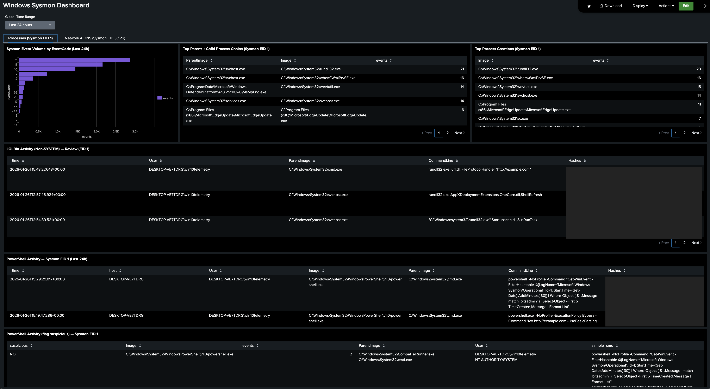
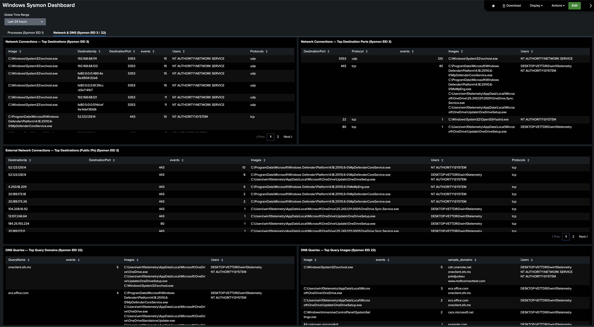

# Windows Sysmon Dashboard (Splunk Dashboard Studio)

This dashboard provides a focused view of Windows endpoint telemetry captured by Sysmon and ingested into Splunk inside the Cyberlab environment.

## Related Documentation (Prerequisite)

This dashboard assumes Sysmon is already installed and forwarding Sysmon event data into Splunk.

Sysmon setup and forwarding documentation:

[Sysmon to Splunk Setup](../../setup/windows-sysmon-to-splunk-setup.md)

---

It was built for one primary goal:

## Windows Endpoint Visibility + Detection Validation

Sysmon is the highest-signal Windows logging source in this lab because it captures process execution, network connections, and DNS activity with far more detail than default Windows logs. This dashboard exists to prove three things:

- **Sysmon ingestion is working end-to-end**

It confirms the Windows endpoint is reliably forwarding Sysmon telemetry into Splunk and that the key fields (Image, CommandLine, ParentImage, DestinationIp/Port, QueryName, etc.) are searchable and usable.

- **I can baseline “normal” activity vs suspicious tradecraft**

This dashboard makes common Windows behaviour visible (service activity, svchost noise, background DNS, routine outbound connections) so suspicious patterns stand out when they occur.

- **My Windows detections are defensible and testable**

Alongside this dashboard, I created a small set of high-signal Sysmon detections focused on common attacker tradecraft (suspicious PowerShell and LOLBin execution). Each detection was validated with controlled test commands so results are repeatable and evidence-backed.

This dashboard supports that workflow by surfacing the key investigation pivots in one place: process execution (including parent/child), command line, hashes, outbound network connections (destination IP/port), and DNS queries. When a detection hits, these panels provide immediate context to confirm the activity and pivot into the raw event data.

This dashboard is intentionally scoped to Windows Sysmon telemetry and detection validation, not cross-source correlation.

---

## Dashboard Structure (Tabs)

This dashboard is split into two tabs:

- **Processes (Sysmon EID 1)**

    Process creation visibility: top process activity, parent/child chains, and focused tables for high-risk execution patterns (PowerShell + LOLBins).

- **Network & DNS (Sysmon EID 3 / 22)**

    Outbound connection visibility (destinations + ports) and DNS query visibility (domains + which processes generated them). This makes it easy to connect “process execution” to “network behaviour” in a single place.

---

## Data Source Used in This Dashboard

Lenovo Thinkpad - Windows 10 VM in VMWare - (Sysmon telemetry forwarded into Splunk)

- **Index:** sysmon
- **Primary Event IDs used:**
    - EID 1 — Process creation
	- EID 3 — Network connection
	- EID 22 — DNS query

---

# Dashboard Panels

## Tab 1 — Processes (Sysmon EID 1)

Each panel in this tab summarises Sysmon Process Create events (Event ID 1) and provides fast visibility into what executed, how it was launched (parent/child), and which command lines and users were involved over the selected time range.

**Screenshot**    



## 1. Sysmon Event Volume by EventCode (Last 24h) — Visualization: Bar Chart

```bash
SPL Used:
index=sysmon source=“XmlWinEventLog:Microsoft-Windows-Sysmon/Operational” earliest=-24h
| stats count as events by EventCode
| sort - events
```

- `index=sysmon source="XmlWinEventLog:Microsoft-Windows-Sysmon/Operational" earliest=-24h` - Search Sysmon Operational events in the sysmon index, restricted to the Sysmon event log source, over the last 24 hours.
- `| stats count as events by EventCode` - Group events by Sysmon `EventCode` (Sysmon Event ID) and count how many events occurred for each type.
- `| sort - events` - Sort results so the most frequent Sysmon event types appear first.

**Purpose:**
Provides a fast “what kind of telemetry am I generating?” view for Sysmon over the last 24 hours. This confirms that Sysmon is actively logging and highlights which event types dominate (for example process creation vs. network connections). It also helps spot misconfiguration or unexpected noise (e.g., unusually high volume of a specific EventCode) before building detections or alerts on top of the data.

### 2. Top Parent → Child Process Chains (Sysmon EID 1) — Visualization: Table

SPL Used:
```bash
index=sysmon EventCode=1
| stats count as events by ParentImage Image
| sort - events
| head 15
```

- `index=sysmon EventCode=1` - Search Sysmon Process Create events only (EventCode=1). This is the core telemetry for “what executed” on the Windows endpoint.
- `| stats count as events by ParentImage Image` - Group process creation events by parent process (`ParentImage`) and child process (`Image`) and count how often each parent→child relationship occurs.
- `| sort - events` - Sort results so the most common process chains appear first.
- `| head 15` - Keep only the top 15 most frequent parent→child chains for readability.

**Purpose:**
Surfaces the most common parent/child execution chains on the endpoint. This gives a quick baseline of “normal” process relationships (e.g., explorer.exe spawning user applications) and helps highlight unusual chains when they appear (for example Office spawning PowerShell, or a browser spawning a scripting engine). This panel is useful both for environment understanding and for validating that Sysmon process creation fields (ParentImage/Image) are being extracted correctly.

### 3. Top Process Creations (Sysmon EID 1) — Visualization: Table

SPL Used:
```bash
index=sysmon source="XmlWinEventLog:Microsoft-Windows-Sysmon/Operational" EventCode=1 earliest=-24h
| stats count as events by Image
| sort - events
| head 20
```

- `EventCode=1` - Filter to Sysmon Process Create events (what executed on the endpoint).
- `earliest=-24h` - Limit results to the last 24 hours for a current baseline view.
- `| stats count as events by Image` - Group events by the executed process path (`Image`) and count how often each process ran.
- `| sort - events` - Sort so the most frequently executed processes appear first.
- `| head 20` - Show only the top 20 processes for readability.

**Purpose:**
Shows which processes are executing most frequently on the Windows endpoint over the last 24 hours. This helps establish a simple baseline of common activity and makes it easier to spot unusual or rare processes when they appear (for example LOLBins such as `rundll32.exe`, `certutil.exe`, or `bitsadmin.exe`). This panel is also a quick validation check that Sysmon EID 1 ingestion and the `Image` field extraction are working correctly.

### 4. LOLBin Activity (Non-SYSTEM) — Review (Sysmon EID 1) — Visualization: Table

SPL Used:
```bash
index=sysmon EventCode=1 Image="C:\\Windows\\System32\\rundll32.exe" User="DESKTOP-VE7TDRG\\win10telemetry" earliest=-24h
| table _time User ParentImage CommandLine Hashes
| sort - _time
```

- `EventCode=1` - Filter to Sysmon Process Create events (process execution).
- `Image="C:\\Windows\\System32\\rundll32.exe"` - Focus specifically on executions of `rundll32.exe`, a common Windows LOLBin (Living-off-the-Land Binary) often abused as an execution proxy.
- `User="DESKTOP-VE7TDRG\\win10telemetry"` - Restrict results to executions under the lab user account (non-SYSTEM context), so the table stays readable and focuses on user-driven activity rather than background OS noise.
- `earliest=-24h` - Limit to the last 24 hours.
- `| table _time User ParentImage CommandLine Hashes` - Output the key investigation fields:
  - `_time` - when it executed
  - `User` - who ran it
  - `ParentImage` - what launched it (critical for process chain context)
  - `CommandLine` - how it was invoked (often where abuse is obvious)
  - `Hashes` - file hashes to support quick triage and IOC-style enrichment later
- `| sort - _time` - Sort newest executions first for quick review.

**Purpose:**
Provides a focused review panel for a high-risk LOLBin (`rundll32.exe`) executed under a normal user context. The goal is fast, human-readable context: when it ran, what launched it, and the exact command line used. This is useful for spotting suspicious rundll32 usage patterns and for quickly validating that Sysmon EID 1 fields (ParentImage, CommandLine, Hashes) are extracting correctly.

### 5. PowerShell Activity — Sysmon EID 1 (Last 24h) — Visualization: Table

SPL Used:
```bash
index=sysmon EventCode=1 earliest=-24h (Image="*\\powershell.exe" OR Image="*\\pwsh.exe")
| table _time host User Image ParentImage CommandLine Hashes
| sort - _time
```
- `EventCode=1` - Restrict to Sysmon Process Create events (process execution telemetry).
- `earliest=-24h` - Limit results to the last 24 hours.
- `(Image="*\\powershell.exe" OR Image="*\\pwsh.exe")` - Match both Windows PowerShell (`powershell.exe`) and PowerShell 7+ (`pwsh.exe`) execution.
- `| table _time host User Image ParentImage CommandLine Hashes` - Display the key investigation fields:
  - when it ran (`_time`)
  - which endpoint (`host`)
  - which account executed it (`User`)
  - the executable (`Image`)
  - what launched it (`ParentImage`)
  - the full command line (`CommandLine`)
  - file hashes for verification (`Hashes`)
- `| sort - _time` - Show the newest PowerShell executions first.

**Purpose:**
Provides a clean, review-friendly list of PowerShell executions from Sysmon process creation telemetry. This acts as a fast pivot point when validating suspicious PowerShell detections (for example encoded commands or download/execute patterns) and makes it easy to confirm parent process context, command-line intent, and the exact binary used (PowerShell vs pwsh).

### 6. PowerShell Activity (flag suspicious) — Sysmon EID 1 (Last 24h) — Visualization: Table

SPL Used:
```bash
index=sysmon EventCode=1 earliest=-24h
(Image="*\\powershell.exe" OR Image="*\\pwsh.exe")
| eval cmd=lower(coalesce(CommandLine,""))
| eval suspicious=if(
    like(cmd,"% -enc %")
 OR like(cmd,"% -encodedcommand %")
 OR like(cmd,"% frombase64string%")
 OR like(cmd,"% iwr %")
 OR like(cmd,"% invoke-webrequest%")
 OR like(cmd,"% downloadstring%")
 OR like(cmd,"% new-object net.webclient%")
 OR like(cmd,"% iex %")
 OR like(cmd,"% invoke-expression%")
 OR like(cmd,"% -nop %")
 OR like(cmd,"% -w hidden%")
 OR like(cmd,"% -windowstyle hidden%")
 OR like(cmd,"% bypass%")
 OR like(cmd,"% -executionpolicy bypass%")
, "YES", "NO")
| stats count as events values(ParentImage) as ParentImage values(User) as User values(CommandLine) as sample_cmd by suspicious Image
| sort suspicious desc - events
```
*In Splunk SPL, like() is a pattern match function. It checks whether a field’s value matches a wildcard pattern. Splunk uses SQL-style wildcards: `%` means “anything before/after”.*

- `EventCode=1` - Restrict to Sysmon Process Create events (process execution).
- `earliest=-24h` - Limit results to the last 24 hours.
- `(Image="*\\powershell.exe" OR Image="*\\pwsh.exe")` - Include both Windows PowerShell and PowerShell 7+.
- `| eval cmd=lower(coalesce(CommandLine,""))` - Create a clean version of the command line for matching:
  - `coalesce(CommandLine,"")` ensures I always have a value (if CommandLine is missing/null, use an empty string instead).
  - `lower(...)` converts it to lowercase so I don’t miss matches because of different capitalisation (e.g., `IWR` vs `iwr`).
- `| eval suspicious=if(...)` - Flag PowerShell executions as suspicious when the command line contains common attacker tradecraft indicators, including:
  - encoded payloads (`-enc`, `-encodedcommand`, `frombase64string`) - Common obfuscation technique: the real command is Base64-encoded to hide intent and evade simple inspection.
  - download/execute patterns (`iwr`, `invoke-webrequest`, `downloadstring`, `new-object net.webclient`, `iex`, `invoke-expression`) - Typical “fetch then run” tradecraft: PowerShell pulls content from a URL and executes it in memory.
  - stealth / reduced visibility options (`-nop`, `-w hidden`, `-windowstyle hidden`) - Used to reduce user-visible signs and avoid loading a normal profile that could trigger logs or slow execution.
  - policy bypass behaviour (`bypass`, `-executionpolicy bypass`) - Attempts to weaken or ignore PowerShell execution restrictions, often seen in scripted attacks and malware loaders.
  Events matching any indicator are labelled `YES`, otherwise `NO`.

- `| stats count as events values(ParentImage) as ParentImage values(User) as User values(CommandLine) as sample_cmd by suspicious Image` - Summarise results:
  - count how many executions occurred
  - show example parent processes, users, and command lines for context
  - group by `suspicious` and the PowerShell executable used (`Image`)
- `| sort suspicious desc - events` - Show suspicious (`YES`) activity first, then order by highest volume.

**Purpose:**
Provides a quick, high-signal summary of PowerShell executions and highlights potentially suspicious command-line behaviour in a single view. This is primarily a validation and triage panel: it surfaces the executions most likely to be malicious (encoded commands, download/execute patterns, hidden window usage, and policy bypass flags) while still keeping a baseline of non-flagged PowerShell activity for comparison.

## Tab 2 — Network & DNS (Sysmon EID 3 / 22)

Each panel in this tab summarises Sysmon Network Connection (Event ID 3) and DNS Query (Event ID 22) events, providing fast visibility into which processes made outbound connections, which destinations and ports were used, and which domains were queried over the selected time range.

**Screenshot**    



### 1. Network Connections — Top Destinations (Sysmon EID 3) — Visualization: Table

SPL Used:
```bash
index=sysmon EventCode=3
| stats count as events values(User) as Users values(Protocol) as Protocols by Image DestinationIp DestinationPort
| sort - events
| head 20
```

- `index=sysmon EventCode=3` - Search Sysmon Network Connection events (Event ID 3) in the sysmon index.

- `| stats ... by Image DestinationIp DestinationPort` - Summarise network connections into one row per:
  - `Image` (which process made the connection)
  - `DestinationIp` + `DestinationPort` (where it connected)

  This summary produces three useful outputs for each row:
  - `count as events` - Total number of matching connection events for that (process + destination IP + port) combination.
  - `values(User) as Users` - A de-duplicated list of the user account(s) seen across those events (context, not a count).
  - `values(Protocol) as Protocols` - A de-duplicated list of the protocol(s) seen (e.g., tcp/udp) across those events.

- `| sort - events` - Sort so the most frequent destinations appear first.
- `| head 20` - Show only the top 20 rows to keep the panel readable.

**Purpose:**
Shows the most common outbound destinations in the time range, tied directly to the process that made the connection. This is a fast pivot for “what is talking to what?” and helps spot unexpected external IPs, unusual ports, or suspicious processes generating network traffic.

### 2. Network Connections — Top Destination Ports (Sysmon EID 3) — Visualization: Table

SPL Used:
```bash
index=sysmon EventCode=3 earliest=-24h
| stats count as events values(Image) as Images values(User) as Users by DestinationPort Protocol
| sort - events
| head 20
```

- `index=sysmon EventCode=3 earliest=-24h` - Search Sysmon Network Connection events (Event ID 3) from the last 24 hours.
- `| stats count as events values(Image) as Images values(User) as Users by DestinationPort Protocol` - Summarise connections into one row per:
  - `DestinationPort` + `Protocol` (which port/protocol is being used)

  For each (port + protocol) row, keep:
  - `events` = total number of Sysmon network connection events matching that port/protocol.
  - `Images` = de-duplicated list of processes observed using that port/protocol (context).
  - `Users` = de-duplicated list of user accounts associated with those connections (context).

- `| sort - events` - Sort so the most frequently used destination ports appear first.
- `| head 20` - Show only the top 20 rows to keep the panel readable.

**Purpose:**
Shows which destination ports are being used most often (and over which protocol), with quick context for which processes and users are responsible. This is a fast way to spot unusual ports (e.g., rare high ports, unexpected service ports) and pivot into the “Top Destinations” panel or raw events to see the exact destination IPs and command lines behind the traffic.

### 3. External Network Connections — Top Destinations (Public IPs) (Sysmon EID 3) — Visualization: Table

SPL Used:
```bash
index=sysmon EventCode=3 earliest=-24h
| where Initiated="true"
| eval dip=DestinationIp
| where match(dip,"^\\d{1,3}(\\.\\d{1,3}){3}$")
| where NOT (
    cidrmatch("10.0.0.0/8", dip) OR
    cidrmatch("172.16.0.0/12", dip) OR
    cidrmatch("192.168.0.0/16", dip) OR
    cidrmatch("127.0.0.0/8", dip) OR
    cidrmatch("169.254.0.0/16", dip) OR
    cidrmatch("224.0.0.0/4", dip)
)
| stats count as events values(Image) as Images values(User) as Users values(Protocol) as Protocols by DestinationIp DestinationPort
| sort -events
| head 20
```

- `index=sysmon EventCode=3 earliest=-24h` - Search Sysmon Network Connection events (Event ID 3) from the last 24 hours.
- `| where Initiated="true"` - Keep only connections initiated by this endpoint (outbound connections), not inbound accepts.
- `| eval dip=DestinationIp` - Create a helper field `dip` (destination IP) so the filtering below is easier to read.
- `| where match(dip,"^\\d{1,3}(\\.\\d{1,3}){3}$")` - Keep only IPv4-looking destination IPs (e.g. `8.8.8.8`). This filters out non-IP values (hostnames, IPv6, blanks, etc.).

- `| where NOT ( ... cidrmatch(...) ... )` - Exclude private/internal and special-use IP ranges so the results focus on *public/external* destinations. `cidrmatch()` is a Splunk SPL function that returns true if an IP address falls inside a CIDR range (e.g. “is dip inside 192.168.0.0/16?”).
  - The ranges excluded here are:
  `cidrmatch("<CIDR>", dip)` returns TRUE when `dip` is inside that CIDR network range:
  - `cidrmatch("10.0.0.0/8", dip)` - Exclude RFC1918 private 10.x.x.x destinations (internal networks).
  - `cidrmatch("172.16.0.0/12", dip)` - Exclude RFC1918 private 172.16.0.0–172.31.255.255 destinations.
  - `cidrmatch("192.168.0.0/16", dip)` - Exclude RFC1918 private 192.168.x.x destinations (common LAN/home ranges).
  - `cidrmatch("127.0.0.0/8", dip)` - Exclude loopback (localhost) destinations; not real external network traffic.
  - `cidrmatch("169.254.0.0/16", dip)` - Exclude link-local (APIPA) addresses; local auto-assigned range, not routable on the internet.
  - `cidrmatch("224.0.0.0/4", dip)` - Exclude multicast destinations (224.0.0.0–239.255.255.255); these are group/broadcast-style traffic, not typical “public internet” targets.

- `| stats count as events values(Image) as Images values(User) as Users values(Protocol) as Protocols by DestinationIp DestinationPort` - Summarise outbound public-IP connections by destination IP + port, including:
  - `events` = how many matching connections occurred
  - `Images` = process(es) that made the connection
  - `Users` = user account(s) tied to those processes
  - `Protocols` = protocol(s) observed (tcp/udp)
- `| sort -events` - Sort so the most frequent external destinations appear first.
- `| head 20` - Show only the top 20 rows to keep the panel readable.

**Purpose:**
Shows the top outbound connections to *public* IP addresses, tied to the process and user that generated them. This is useful for spotting unexpected external destinations, unusual destination ports, or suspicious processes that are “phoning home” or reaching out to the internet.

### 4. DNS Queries — Top Query Domains (Sysmon EID 22) — Visualization: Table

SPL Used:
```bash
index=sysmon EventCode=22 earliest=-24h
| eval host_lc=lower(host), q_lc=lower(QueryName)
| where q_lc!="wpad" AND q_lc!=host_lc
| stats count as events values(Image) as Images values(User) as Users by QueryName
| sort - events
| head 20
```

- `index=sysmon EventCode=22 earliest=-24h` - Search Sysmon DNS Query events (Event ID 22) from the last 24 hours.
- `| eval host_lc=lower(host), q_lc=lower(QueryName)` - Create lowercase helper fields so comparisons are case-insensitive:
  - `host_lc` = hostname in lowercase
  - `q_lc` = DNS query name in lowercase
- `| where q_lc!="wpad" AND q_lc!=host_lc` - Drop two common “noise” items:
  - `wpad` (Web Proxy Auto-Discovery) often appears in normal environments and is usually low-value for this top-list.
  - `q_lc!=host_lc` filters out queries that equal the host name (often local/host-related lookups that don’t add much for external DNS visibility).
- `| stats count as events values(Image) as Images values(User) as Users by QueryName`
  - Group by `QueryName` (the domain queried).
  - `events` = how many times that domain was queried.
  - Also keep context:
    - `Images` = which process(es) generated the queries
    - `Users` = which user account(s) were associated
- `| sort - events` - Sort so the most frequently queried domains appear first.
- `| head 20` - Show only the top 20 domains to keep the panel readable.

**Purpose:**
Shows the most frequently queried DNS domains, with quick context on which processes and users generated those lookups. This is a fast pivot for spotting unexpected domains, unusually frequent lookups, or suspicious processes driving DNS activity.

### 5. DNS Queries — Top Query Images (Sysmon EID 22) — Visualization: Table

SPL Used:
```bash
index=sysmon EventCode=22 earliest=-24h
| eval host_lc=lower(host), q_lc=lower(QueryName)
| where q_lc!="wpad" AND q_lc!=host_lc
| stats count as events values(QueryName) as sample_domains values(User) as Users by Image
| sort - events
| head 20
```

- `index=sysmon EventCode=22 earliest=-24h` - Search Sysmon DNS Query events (Event ID 22) from the last 24 hours.
- `| eval host_lc=lower(host), q_lc=lower(QueryName)` - Create lowercase helper fields so comparisons are case-insensitive:
  - `host_lc` = hostname in lowercase
  - `q_lc` = DNS query name in lowercase
- `| where q_lc!="wpad" AND q_lc!=host_lc` - Reduce common noise:
  - exclude `wpad` (proxy auto-discovery noise in many environments)
  - exclude queries equal to the hostname (often local/host-related lookups)
- `| stats count as events values(QueryName) as sample_domains values(User) as Users by Image`
  - Group by `Image` (which process performed the DNS queries).
  - `events` = how many DNS query events that process generated.
  - `sample_domains` = a set of example domains that process queried (helpful context without listing every domain).
  - `Users` = the user account(s) associated with those DNS queries.
- `| sort - events` - Sort so the most DNS-active processes appear first.
- `| head 20` - Show only the top 20 processes to keep the panel readable.

**Purpose:**
Shows which processes are generating the most DNS queries, with example domains and user context. This is useful for quickly spotting unusual “DNS-heavy” processes (for example an unexpected binary repeatedly resolving domains) and then pivoting into the specific domains or related network connections.