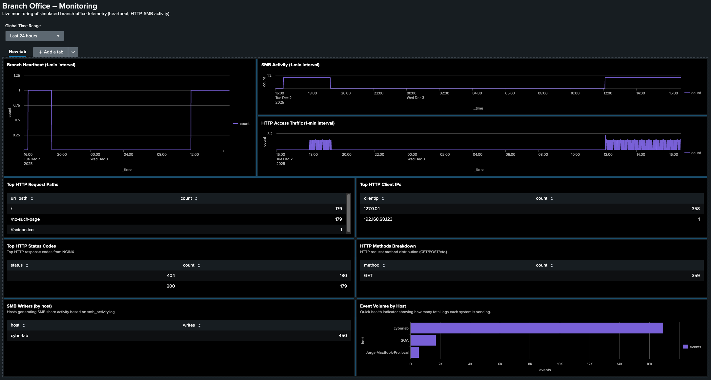
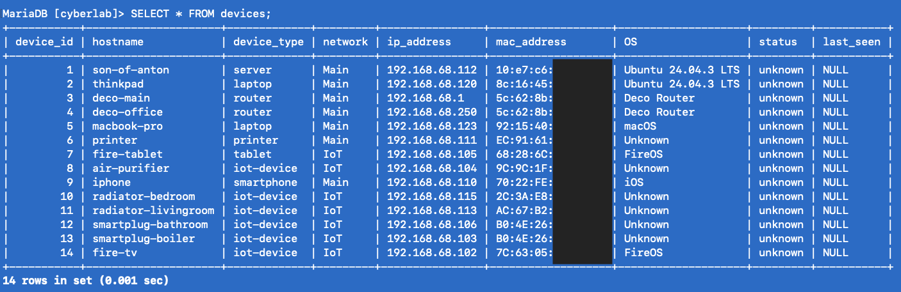
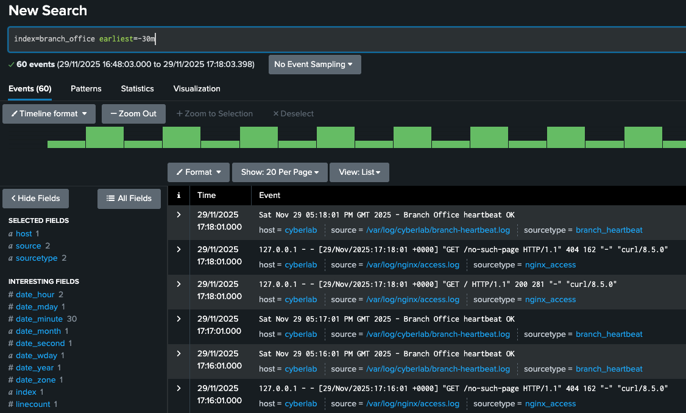
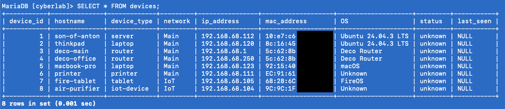

# 📓 Cyberlab Progress Log 

This file tracks the evolution of the Cyberlab project over time.  
Entries are added as new components are installed, tested, or refined.  

---
## 19-01-2026
Suricata IDS Dashboard Documentation (Splunk Dashboard Studio)
- Completed and added full documentation for the Network Security - Suricata IDS dashboard, covering all dasboard tabs:
  - **Alerts Overview** (severity distribution, alert volume over time, top signatures/categories, top attacker IPs, top targeted internal IPs/services on SOA, most recent alerts)
  - **HTTP Activity** (Victim 8080) (unique scanners, top scanners, top URLs, top user agents, scan rate, status codes, HTTP methods)
  - **SOC Incident Queue** (high severity alerts, new high alerts last 15m, active high-severity incidents table)

- Included each panel’s SPL query with line-by-line explanations to keep the dashboard reproducible and easy to audit.
- Linked the dashboard doc back to the existing Suricata IDS setup guide to avoid duplicating installation/configuration instructions.

[Suricata IDS Dashboard Documentation](setup/suricata-ids-setup.md)

## 12-01-2026
Suricata IDS Installation & Integration   
- Installed and configured Suricata on the Desktop PC / Server to add network-level intrusion detection to the Cyberlab environment.
- Updated suricata.yaml to define the correct HOME_NET subnet and enabled community-id for flow correlation.
- Loaded and validated Suricata rules and confirmed alerts were being generated via test scans.
- Created a dedicated Splunk index (ids) for Suricata data.
- Configured Splunk ingestion to monitor eve.json and parse events as JSON.
- Implemented pre-index filtering to drop low-value events (e.g. flow, stats) while retaining security-relevant data (alerts, HTTP, TLS, DNS, SSH), keeping license usage minimal.
- Verified end-to-end visibility by triggering Suricata alerts with controlled nmap scans and confirming ingestion in Splunk.
- Created a dedicated Suricata setup guide in the GitHub repository to fully document installation, configuration, and Splunk integration steps. [suricata IDS setup](setup/suricata-ids-setup.md)

## 08-01-2026
Bitcoin Node Pruning (Storage Optimization)   
- Pruned the Bitcoin full node running in a Docker container on the Dsktop PC / Server to reduce disk usage on the external SSD.
- Identified that the blockchain data directory (/mnt/bitcoin/data) was consuming ~830 GB, primarily due to the blocks/ directory.
- Disabled txindex, which is incompatible with prune mode.
- Enabled pruning in bitcoin.conf with a target size of 500 GB.
- Final disk usage reduced to ~511 GB, freeing over 300 GB on the external SSD.

## 05-01-2026
Created a dedicated Windows 10 Pro malware analysis sandbox VM using VMware on the Windows boot of the Lenovo ThinkPad.
Installed core dynamic analysis tools inside the sandbox VM:
- System Informer (formerly Process Hacker)
- Process Explorer
- Process Monitor (ProcMon)
- Fiddler
- Wireshark
- Regshot
- HashMyFiles
Purpose of the sandbox is to support dynamic malware analysis, including observation of runtime file system activity, registry changes, process creation, privilege usage, and network behaviour, in an isolated environment separate from production endpoints.
Updated the network diagram.

## 12-12-2025
- Completed the Endpoint Activity Dashboard in Splunk, focusing on validating endpoint telemetry rather than attack detection. 
- Finalised and uploaded full dashboard documentation, clearly documenting current limitations (macOS auth excluded for now) and establishing a clean baseline for future security-focused panels. 
- [Splunk Endpoint Activity Dashboard](docs/splunk_dashboards/endpoint_activity_dashboard.md)

## 06-12-2025
I spent the whole day focusing on macOS authentication logs from the MacBook Pro into the endpoints index in Splunk. Enabled an extra logd://auth stanza to pull com.apple.opendirectoryd “Authentication …” messages and confirmed that both successful and failed logins/unlocks were being ingested, but each real attempt generated many completely duplicate events, so the counts were unusable. After multiple attempts at fixing this with SPL (grouping, bucketing, and de-duplication), I still couldn’t get reliable “per attempt” metrics, so for now I disabled the custom logd://auth stanza again to cut noise and parked the problem for a future, more advanced solution. If anyone reads this and knows how to get this working please let me know.

## 03-12-2025
- Built the first full Splunk dashboard in Dashboard Studio to validate branch-office telemetry (heartbeat, HTTP access logs, SMB activity).
- Created a detailed documentation file for the dashboard in `docs/splunk_dashboards/splunk_branch_office_dashboard.md`, including SPL queries and explanations of each panel. [Splunk Branch Office Dashboard](docs/splunk_dashboards/splunk_branch_office_dashboard.md)
- Verified that all synthetic telemetry sources from the ThinkPad “branch office” are being ingested correctly into the `branch_office` index.
- Added additional devices to the MariaDB `devices` table as part of ongoing inventory expansion.
- Updated the main Cyberlab network diagram to include all newly added devices and reflect the current topology.

## 02-12-2025
- Added three new setup guides to the Cyberlab documentation:
  - [NGINX setup](setup/nginx-setup.md) (NGINX installation, log paths, cron-driven synthetic HTTP traffic)
  - [SMB Samba setup](setup/smb-samba-setup.md) (SMB/Samba share configuration, cron-driven activity and logging)
  - [Branch Heartbeat setup](setup/branch-heartbeat-setup.md) (1-minute heartbeat logging service running via cron)
- Noticed Splunk didn't extract fields from the NGINX logs. Installed the Splunk Add-on for NGINX on the main Splunk server (free app directly from Splunk)
- Corrected NGINX log ingestion to use the access_combined sourcetype rather than nginx_access so the Splunk Add-on field extractions work properly.
- Updated inputs.conf on the ThinkPad UF to enforce the correct sourcetype
- Confirmed that the add-on’s field extraction pipeline works as expected (clientip, status, method, uri_path, etc.)
- Verified ingestion end-to-end by running new searches and ensuring fields are extracted automatically

## 29-11-2025
- Turned the Lenovo ThinkPad into a small “branch office” node
- Installed NGINX on Ubuntu and replaced the default page with a simple internal test page served on http://192.168.68.120
- Enabled a Samba/SMB file share (/srv/samba/share)
- Created cron-driven synthetic web traffic (/ and /no-such-page) and `branch_heartbeat.sh` which writes a one-line “Branch Office heartbeat OK” status every minute to `/var/log/cyberlab/branch-heartbeat.log`
- Created new Splunk index branch_office.
- Configured UF to forward NGINX logs + heartbeat logs.
- Verified ingestion in Splunk.
- Noticed MacBook Pro jumped from .123 → .122. Added proper DHCP reservation in Deco so MacBook always stays at 192.168.68.123
- Updated the network diagram

## 28-11-2025
- Completed the networking fundamentals work for the Cyberlab documentation.
- Captured routing table behaviour on the MacBook Pro, analysed how local vs gateway traffic is decided, and added a clean explanation to the new docs/networking_fundamentals.md file.
- Added the SSH packet → Splunk correlation test (failed SSH login attempt) with supporting screenshots from Wireshark and Splunk.
- Updated the main network diagram to include the /22 subnet mask and ip addresses.

## 27-11-2025
- Began building a device inventory inside the existing MariaDB container. Added missing schema fields (device_type, network) and updated all main Cyberlab machines (Server, ThinkPad, Deco nodes, MacBook Pro)
- Purpose was SQL practice rather than building a full asset-management system — reinforcing Docker + MariaDB workflow, table updates, and manual row inserts. Will continue adding more devices regularly to build repetition and familiarity

- Inspected ARP and DNS traffic on the MacBook Pro using Wireshark.
- Performed a full network sweep using Nmap executed from the ThinkPad to validate MAC/IP mappings for the device inventory.

**Lessons Learned:**
- ARP caching hides traffic you expect to see. Initially, the MacBook Pro did not show ARP broadcasts for the ThinkPad because the MAC address was already cached locally. Fix: clear the ARP cache before capture `sudo arp -d -a`
- macOS blocks raw-socket ARP scans. Nmap ARP discovery (nmap -sn) fails on macOS, even with Full Disk Access and Developer Tools Access. Resolution: run Nmap on the Linux ThinkPad instead.

## 07-11-2025
- Installed **Splunk Enterprise (Indexer + Search Head)** on the **Desktop PC** and enabled local log monitoring.
- Installed and configured **Splunk Universal Forwarder** on all endpoints: the **Lenovo ThinkPad** (Ubuntu + Windows 10 Pro) and the **MacBook Pro** (latest macOS).
- Verified forwarding from all machines to the Desktop PC.
- All logs unified under the `endpoints` index and visible in Splunk Web.
- Updated the network diagram.

**Lessons learned:** Splunk forwarders often appear fully installed but send no data until `outputs.conf`, `inputs.conf`, the correct index and receiving port `9997` are all configured and the service is actually running. Always verify each step of the ingest chain.

## 03-11-2025 (cleanup)
- Archived `db_connection_test.py` and associated `.env.sample` into `archive_scripts/db_connection_test/`.
- Committed and pushed the archive changes to GitHub.
- Rationale: preserve learning artifacts while keeping the public repo focused on active Cyber Security projects.

## 04-09-2025
- Deployed a new container running a full Bitcoin node to validate the blockchain.
- Deployed an additional container with **SatoshiTop**, a dashboard similar to htop but for Bitcoin node monitoring.
- Updated the network diagram accordingly.
- Not directly cybersecurity related so won't go into too much detail here. Just something I'm personally interested in.

## 30-08-2025 (archived / legacy)

- **Goal:**  
  Python script runs in the background, scans all devices for open ports, and updates the SQL database accordingly.

- **Progress:**  
  - Created a SQL database in the MariaDB container with 2 tables: one for inventory and one for open ports logging.  
  - Manually populated the inventory DB with IP, MAC address, name, OS, and last seen.  
  - Added Python test script `db_connection_test.py` to the `scripts/` folder.  
  - Purpose: establish a connection to the MariaDB container and confirm I can query the `devices` table using values from `.env`.  
  - Verified that `.env` loading works automatically via `python-dotenv`, so no need to manually `source` environment variables.  
  - Queried device by hostname ("thinkpad") and successfully retrieved details (`device_id`, `hostname`, `ip_address`).  
  - This script is only a first test to prove database connectivity before moving on to the real port-scanning and updating database.  

## 25-08-2025
- Created initial **Cyberlab network diagram** and added to `diagrams/`.  
- Segmented IoT devices to their own SSID outside Cyberlab scope.  

## 22-08-2025
- Installed Ubuntu and **Docker** on Desktop PC (simulated branch office).  
- Deployed **MariaDB 10.11 container** to store small home inventory dataset.

## 25-07-2025
- Completed setup of **Lenovo ThinkPad T480** with Ubuntu, Windows 10 Pro, and Kali in VirtualBox.  
- Configured Virgin Hub in **modem-only mode**.  
- Deployed TP-Link Deco mesh as main router/AP. 