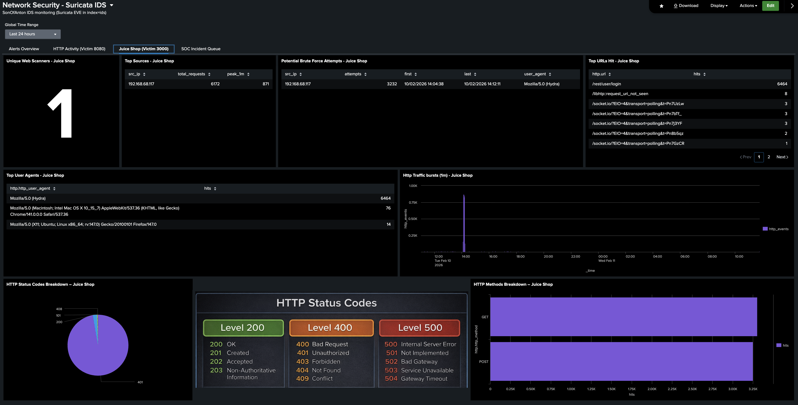
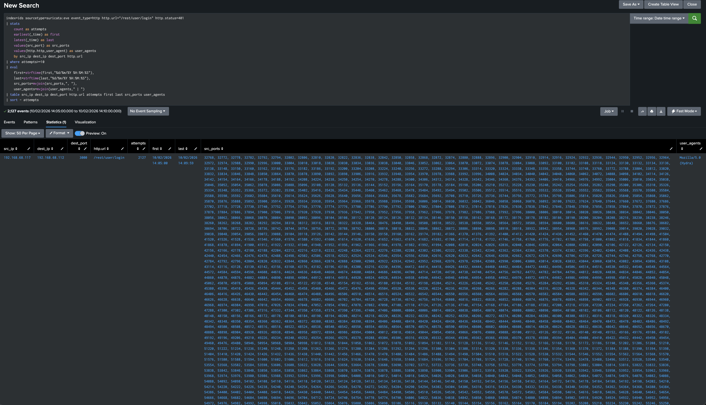
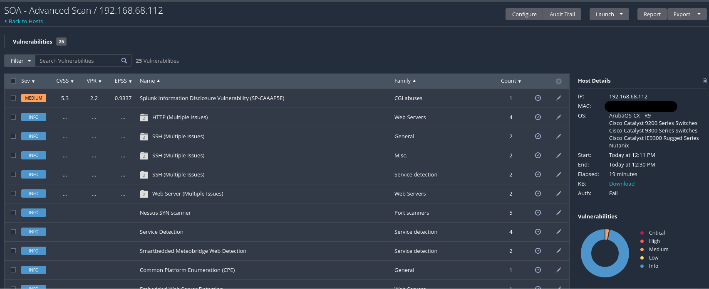
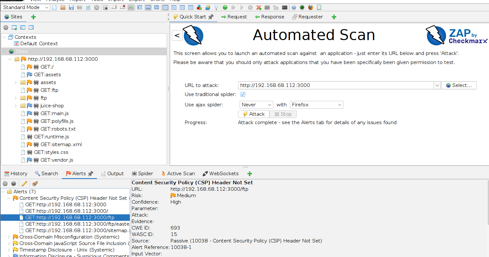

# 📓 Cyberlab Progress Log 

This file tracks the evolution of the Cyberlab project over time.  
Entries are added as new components are installed, tested, or refined.  

---
## 12-02-2026  
ALERT-003 Juice Shop Brute Force Alert Logic Update (401 → Endpoint Rate)

- Updated **[ALERT-003](/docs/alerts/alert_003_possible_brute_force.md)** to remove the `http.status=401` dependency and detect **high-rate login requests** to `/rest/user/login` instead
  - Reason: OWASP Juice Shop can return **HTTP 200** for failed logins (failure indicated in the response body), and Suricata HTTP telemetry does not reliably capture that
  - Result: alert now triggers on **behaviour (request rate)** rather than status-code-based “failures” to avoid missing real brute force activity

## 11-02-2026  
Suricata IDS Dashboard Documentation Update (Juice Shop Tab)

- Updated the **[Network Security – Suricata IDS](/docs/splunk_dashboards/suricata_ids_dashboard.md)** dashboard documentation to reflect the new **Juice Shop (Victim 3000)** tab
  - Tab is a basically a copy of the **Victim 8080** HTTP activity view, updated to `dest_port=3000`
  - Includes the additional **Potential Brute Force Attempts — Juice Shop** panel (based on **[ALERT-003](/docs/alerts/alert_003_possible_brute_force.md)** logic)
  - Added a small **HTTP status code reference image** panel for faster interpretation during triage

## 10-02-2026  
Juice Shop Brute Force Detection + IR Writeup (Hydra → Splunk Alert)

- Built a new Splunk scheduled alert to flag **possible brute force** against OWASP Juice Shop:
  - **ALERT-003 Juice Shop — Possible Brute Force (>=10 failed logins / 5m)**
  - Uses **Suricata HTTP telemetry** (`index=ids`, `sourcetype=suricata:eve`) to detect repeated `401` responses to `/rest/user/login`
  - Validated that the alert triggers reliably during sustained automated login attempts

- Ran a controlled brute-force style lab test using **Hydra** against **SOA:3000 (Juice Shop)** to generate detection telemetry:
  - Confirmed the alert triggered (twice) due to the activity spanning multiple 5-minute windows
  - Observed **Hydra** in `http.http_user_agent` in Splunk results (useful triage context)

- Published a new incident response report documenting the lab workflow (simulate → detect → triage):
  - `docs/reports/ir_001_juice_shop_bruteforce_hydra.md` - Includes evidence screenshots (alert results + dashboard context)

## 06-02-2026  
Nessus Advanced Scan → Splunk Information Disclosure Vulnerability + Remediation Writeup

- Installed and configured **Nessus Essentials** on Kali (VM) to validate vuln scanning workflow in Cyberlab
- Ran a **Nessus Advanced Scan** against **SOA (192.168.68.112)** and reviewed findings
  - One **Medium** finding flagged: **Splunk Information Disclosure Vulnerability (SP-CAAAP5E / CVE-2018-11409)**

- Investigated the finding using Splunk vendor documentation + REST API reference, then validated locally:
  - Confirmed **unauthenticated** access to the Splunk management API endpoint on **127.0.0.1:8089** returned instance/system/license metadata (**HTTP 200 OK**)
  - Verified scope: **8089 is blocked on the LAN by UFW**, so the exposure was **local-only** (not reachable from other hosts)

- Remediated by hardening Splunk REST handler auth config:
  - Updated `/opt/splunk/etc/system/local/restmap.conf` to set `requireAuthentication = true` for `server-info` stanzas
  - Restarted Splunk and re-tested to confirm **HTTP 401 Unauthorized**

- Published a new finding writeup documenting the end-to-end workflow (scan → research → validate → remediate → re-test):
  - [VULN-001 Nessus Finding: Splunk Information Disclosure Vulnerability (SP-CAAAP5E) (Fixed)](/docs/reports/vuln_001_nessus_finding_splunk_info_disclosure.md)

**Screenshot**

## 04-02-2026
OWASP ZAP Web Scan → Suricata Web Alert Burst Detection + Case Report

- Added a new intentionally vulnerable web target to generate realistic web-attack telemetry against SOA:
  - Deployed **OWASP Juice Shop** in a new Docker container on **SOA** and exposed it on **TCP 3000** (LAN only)
- Installed **OWASP ZAP** on Kali to generate controlled “web attack” activity for detection validation
  - Ran an **Automated Scan** against the Juice Shop target (SOA:3000) to generate web probing / exploit-style traffic

- Published a new Suricata detection focused on web exploitation signature bursts:
  - [DET-008 Suricata — Web Attack Signature Burst (ET WEB / HUNTING)](docs/detections/det_008_suricata_web_attack)  

- Published a second case report to document the end-to-end workflow (test → detect → corroborate):
  - [CASE-002 — Web Scanner Activity Against SOA Detected (Suricata DET-008 + UFW corroboration)](docs/reports/case_002_web_scanner_activity.md)  

**Screenshot**

## 03-02-2026
Suricata Port Scan Detection + Alert + First Case Report

- Added a new Suricata-based scan detection to validate internal recon visibility in Splunk:
  - [DET-007 Suricata — Nmap/Port Scan (ET SCAN by unique ports))](docs/detections/det_007_suricata_port_scan.md)  
    Hunt/validation search that buckets ET SCAN alerts into 5-minute windows and flags scan-like bursts based on unique destination ports, alert volume, and signature variety.

- Turned the Suricata scan detection into a scheduled alert for continuous monitoring:
  - [ALERT-002 ET SCAN Recon Activity Detected (Port Scan/Probing)](docs/alerts/alert_002_port_scan_activity.md)  
    Scheduled hourly with throttling to avoid spam; logs into Triggered Alerts for a SOC-style queue.

- Published the first Cyberlab case report to document an end-to-end “test → detect → corroborate” workflow:
  - [CASE-001 — Nmap Port Scan Against SOA Detected (Suricata + UFW corroboration)](docs/reports/case_001_nmap_scan_against_soa_detected.md)  
    Correlates Suricata ET SCAN alerts with UFW multi-port block telemetry to confirm recon behaviour and verify the pipeline is working.

- Documented a Suricata config finding that affects internal detection visibility in a home lab:
  - [Finding-002 Suricata default HOME_NET/EXTERNAL_NET settings suppress internal scan alerts in a lab](docs/findings/finding_002_suricata_settings_suppress_internal_scan_alerts.md)  
    Adjusted network variable scope so internal lab scans are not excluded from triggering scan signatures.

- Updated README to include the new detection, alert, case report, and finding.

## 02-02-2026
UFW Detection Additions (SOA / Splunk)  
- Added two new UFW-based detections to the repo to capture scan / probing behaviour from host firewall telemetry on SOA:
  - [DET-005 SOA UFW — Top Blocked Sources (Ports/Proto)](docs/detections/det_005_ufw_top_blocked_sources.md)  
    Quick hunt to identify the noisiest blocked source IPs and the most-targeted destination ports/protocols.

  - [DET-006 SOA UFW Port Sweep / Multi-Port Probe (Blocks)](docs/detections/det_006_ufw_port_sweep_blocks.md)  
    Hunt search to flag potential port-sweep behaviour by spotting sources generating blocked traffic across many destination ports.

- Updated README to include both new UFW detections.

## 01-02-2026
Findings folder + first write-up
- Added `/findings/` to document security observations and mitigations in Cyberlab.
- Published Finding-001: UFW status hides Docker-published ports (iptables/netfilter is the source of truth).
    - [Finding-001 UFW vs IPtables](docs/findings/finding_001_ufw_vs_iptables.md)

## 31-01-2026
Sysmon Detection Additions (Splunk)    
- Added two additional Windows Sysmon detections to the repo:
    - [DET-003 BITSAdmin Transfer (Sysmon EID 1)](docs/detections/det_003_bitsadmin_transfer.md)  
    Hunt search to identify `bitsadmin.exe` usage consistent with background file transfer / payload staging.

    - [DET-004 CertUtil Suspicious Usage (Sysmon EID 1)](docs/detections/det_004_certutil_suspicious_usage.md)  
    Hunt search to identify suspicious `certutil.exe` usage patterns commonly used for download, decode, or file staging.

- These expand the Windows LOLBin coverage by adding reproducible “living off the land” detections for two common attacker utilities.
- Updated the README

I also learned that UFW is a front-end to netfilter, and Docker can add its own iptables rules when ports are published—so ufw status alone isn’t the full picture. I rebuilt my MariaDB container without published ports and confirmed 3306 is no longer exposed on the host after a nmap scan revealed it being published.

## 30-01-2026
UFW Host Firewall Setup (SOA / Ubuntu 24.04 LTS)

- Enabled and configured UFW on SOA (192.168.68.112) as a LAN-only host firewall to reduce exposure while keeping Cyberlab services accessible internally.
- Allowed inbound LAN access to:
    - 22/tcp (SSH)
    - 8000/tcp (Splunk Web)
    - 9997/tcp (Splunk receiving port)
- Integrated UFW logging into Splunk by monitoring /var/log/ufw.log (index: endpoints, sourcetype: ufw) and added a UFWACTION field extraction for action values (ALLOW / BLOCK / AUDIT / AUDIT INVALID).
- Updated Cyberlab Network Diagram to reflect UFW host firewall running on the desktop PC / server.
- Updated README

## 28-01-2026
Sysmon Detections & Alert Documentation (Splunk)

Added the first Windows Sysmon detection content to the repo:
- [ALERT-001 Encoded PowerShell (Sysmon EID 1)](docs/alerts/alert_001_encoded_powershell.md)
- [DET-001 Encoded PowerShell (Sysmon EID 1)](docs/detections/det_001_encoded_powershell.md)
- [DET-002 Suspicious PowerShell Download/Exec (Sysmon EID 1)](docs/detections/det_002_suspicious_powershell_download.md)

These are the first reproducible, documented Windows detections in the lab (SPL + test steps), forming the starting point for a dedicated Detections & Alerts section in the repo.

Updated the README to link to the new alert and detection documentation so it’s easy to find.

## 27-01-2026

Windows Sysmon Dashboard Documentation (Splunk Dashboard Studio)
- Completed and added documentation for the Windows Sysmon dashboard, covering both dashboard tabs:
    - Processes (Sysmon EID 1) (event volume by EventCode, top parent → child process chains, top process creations, LOLBin review table, PowerShell activity table, and a “flag suspicious” PowerShell summary panel)
    - Network & DNS (Sysmon EID 3 / 22) (top outbound destinations, top destination ports, external/public IP destinations, top DNS query domains, and top DNS query images)
- Included each panel’s SPL query with clear explanations of what it’s doing and why it exists (including key SPL functions used such as like cidrmatch()), to keep the dashboard reproducible and easy to audit.

[Windows Sysmon Dashboard Documentation](docs/splunk_dashboards/windows_sysmon_dashboard.md)

## 22-01-2026

Sysmon (Windows Endpoint Telemetry) → Splunk Integration
- Installed Sysmon on the Windows 10 telemetry VM (VMware Workstation) using Olaf Hartong’s hardened config (XML).
- Installed Splunk Add-on for Sysmon (Splunk_TA_microsoft_sysmon) on SOA (the Desktop PC / Server) for proper field extractions.
- Created a dedicated Splunk index (sysmon) and configured the UF to ingest Microsoft-Windows-Sysmon/Operational with renderXml=true.
- Resolved parsing issues by validating the correct event source=XmlWinEventLog:Microsoft-Windows-Sysmon/Operational so the TA applies extractions.
- Verified ingestion + usable fields in Splunk and added a Sysmon setup guide: [Sysmon setup](setup/windows-sysmon-to-splunk-setup.md)
- Updated README and Network Diagram

## 19-01-2026
Suricata IDS Dashboard Documentation (Splunk Dashboard Studio)
- Completed and added full documentation for the Network Security - Suricata IDS dashboard, covering all dasboard tabs:
  - **Alerts Overview** (severity distribution, alert volume over time, top signatures/categories, top attacker IPs, top targeted internal IPs/services on SOA, most recent alerts)
  - **HTTP Activity** (Victim 8080) (unique scanners, top scanners, top URLs, top user agents, scan rate, status codes, HTTP methods)
  - **SOC Incident Queue** (high severity alerts, new high alerts last 15m, active high-severity incidents table)

- Included each panel’s SPL query with line-by-line explanations to keep the dashboard reproducible and easy to audit.
- Linked the dashboard doc back to the existing Suricata IDS setup guide to avoid duplicating installation/configuration instructions.

[Suricata IDS Dashboard Documentation](setup/suricata-ids-setup.md)

## 12-01-2026
Suricata IDS Installation & Integration   
- Installed and configured Suricata on the Desktop PC / Server to add network-level intrusion detection to the Cyberlab environment.
- Updated suricata.yaml to define the correct HOME_NET subnet and enabled community-id for flow correlation.
- Loaded and validated Suricata rules and confirmed alerts were being generated via test scans.
- Created a dedicated Splunk index (ids) for Suricata data.
- Configured Splunk ingestion to monitor eve.json and parse events as JSON.
- Implemented pre-index filtering to drop low-value events (e.g. flow, stats) while retaining security-relevant data (alerts, HTTP, TLS, DNS, SSH), keeping license usage minimal.
- Verified end-to-end visibility by triggering Suricata alerts with controlled nmap scans and confirming ingestion in Splunk.
- Created a dedicated Suricata setup guide in the GitHub repository to fully document installation, configuration, and Splunk integration steps. [suricata IDS setup](setup/suricata-ids-setup.md)

## 08-01-2026
Bitcoin Node Pruning (Storage Optimization)   
- Pruned the Bitcoin full node running in a Docker container on the Dsktop PC / Server to reduce disk usage on the external SSD.
- Identified that the blockchain data directory (/mnt/bitcoin/data) was consuming ~830 GB, primarily due to the blocks/ directory.
- Disabled txindex, which is incompatible with prune mode.
- Enabled pruning in bitcoin.conf with a target size of 500 GB.
- Final disk usage reduced to ~511 GB, freeing over 300 GB on the external SSD.

## 05-01-2026
Created a dedicated Windows 10 Pro malware analysis sandbox VM using VMware on the Windows boot of the Lenovo ThinkPad.
Installed core dynamic analysis tools inside the sandbox VM:
- System Informer (formerly Process Hacker)
- Process Explorer
- Process Monitor (ProcMon)
- Fiddler
- Wireshark
- Regshot
- HashMyFiles
Purpose of the sandbox is to support dynamic malware analysis, including observation of runtime file system activity, registry changes, process creation, privilege usage, and network behaviour, in an isolated environment separate from production endpoints.
Updated the network diagram.

## 12-12-2025
- Completed the Endpoint Activity Dashboard in Splunk, focusing on validating endpoint telemetry rather than attack detection. 
- Finalised and uploaded full dashboard documentation, clearly documenting current limitations (macOS auth excluded for now) and establishing a clean baseline for future security-focused panels. 
- [Splunk Endpoint Activity Dashboard](docs/splunk_dashboards/endpoint_activity_dashboard.md)

## 06-12-2025
I spent the whole day focusing on macOS authentication logs from the MacBook Pro into the endpoints index in Splunk. Enabled an extra logd://auth stanza to pull com.apple.opendirectoryd “Authentication …” messages and confirmed that both successful and failed logins/unlocks were being ingested, but each real attempt generated many completely duplicate events, so the counts were unusable. After multiple attempts at fixing this with SPL (grouping, bucketing, and de-duplication), I still couldn’t get reliable “per attempt” metrics, so for now I disabled the custom logd://auth stanza again to cut noise and parked the problem for a future, more advanced solution. If anyone reads this and knows how to get this working please let me know.

## 03-12-2025
- Built the first full Splunk dashboard in Dashboard Studio to validate branch-office telemetry (heartbeat, HTTP access logs, SMB activity).
- Created a detailed documentation file for the dashboard in `docs/splunk_dashboards/splunk_branch_office_dashboard.md`, including SPL queries and explanations of each panel. [Splunk Branch Office Dashboard](docs/splunk_dashboards/splunk_branch_office_dashboard.md)
- Verified that all synthetic telemetry sources from the ThinkPad “branch office” are being ingested correctly into the `branch_office` index.
- Added additional devices to the MariaDB `devices` table as part of ongoing inventory expansion.
- Updated the main Cyberlab network diagram to include all newly added devices and reflect the current topology.

## 02-12-2025
- Added three new setup guides to the Cyberlab documentation:
  - [NGINX setup](setup/nginx-setup.md) (NGINX installation, log paths, cron-driven synthetic HTTP traffic)
  - [SMB Samba setup](setup/smb-samba-setup.md) (SMB/Samba share configuration, cron-driven activity and logging)
  - [Branch Heartbeat setup](setup/branch-heartbeat-setup.md) (1-minute heartbeat logging service running via cron)
- Noticed Splunk didn't extract fields from the NGINX logs. Installed the Splunk Add-on for NGINX on the main Splunk server (free app directly from Splunk)
- Corrected NGINX log ingestion to use the access_combined sourcetype rather than nginx_access so the Splunk Add-on field extractions work properly.
- Updated inputs.conf on the ThinkPad UF to enforce the correct sourcetype
- Confirmed that the add-on’s field extraction pipeline works as expected (clientip, status, method, uri_path, etc.)
- Verified ingestion end-to-end by running new searches and ensuring fields are extracted automatically

## 29-11-2025
- Turned the Lenovo ThinkPad into a small “branch office” node
- Installed NGINX on Ubuntu and replaced the default page with a simple internal test page served on http://192.168.68.120
- Enabled a Samba/SMB file share (/srv/samba/share)
- Created cron-driven synthetic web traffic (/ and /no-such-page) and `branch_heartbeat.sh` which writes a one-line “Branch Office heartbeat OK” status every minute to `/var/log/cyberlab/branch-heartbeat.log`
- Created new Splunk index branch_office.
- Configured UF to forward NGINX logs + heartbeat logs.
- Verified ingestion in Splunk.
- Noticed MacBook Pro jumped from .123 → .122. Added proper DHCP reservation in Deco so MacBook always stays at 192.168.68.123
- Updated the network diagram

## 28-11-2025
- Completed the networking fundamentals work for the Cyberlab documentation.
- Captured routing table behaviour on the MacBook Pro, analysed how local vs gateway traffic is decided, and added a clean explanation to the new docs/networking_fundamentals.md file.
- Added the SSH packet → Splunk correlation test (failed SSH login attempt) with supporting screenshots from Wireshark and Splunk.
- Updated the main network diagram to include the /22 subnet mask and ip addresses.

## 27-11-2025
- Began building a device inventory inside the existing MariaDB container. Added missing schema fields (device_type, network) and updated all main Cyberlab machines (Server, ThinkPad, Deco nodes, MacBook Pro)
- Purpose was SQL practice rather than building a full asset-management system — reinforcing Docker + MariaDB workflow, table updates, and manual row inserts. Will continue adding more devices regularly to build repetition and familiarity

- Inspected ARP and DNS traffic on the MacBook Pro using Wireshark.
- Performed a full network sweep using Nmap executed from the ThinkPad to validate MAC/IP mappings for the device inventory.

**Lessons Learned:**
- ARP caching hides traffic you expect to see. Initially, the MacBook Pro did not show ARP broadcasts for the ThinkPad because the MAC address was already cached locally. Fix: clear the ARP cache before capture `sudo arp -d -a`
- macOS blocks raw-socket ARP scans. Nmap ARP discovery (nmap -sn) fails on macOS, even with Full Disk Access and Developer Tools Access. Resolution: run Nmap on the Linux ThinkPad instead.

## 07-11-2025
- Installed **Splunk Enterprise (Indexer + Search Head)** on the **Desktop PC** and enabled local log monitoring.
- Installed and configured **Splunk Universal Forwarder** on all endpoints: the **Lenovo ThinkPad** (Ubuntu + Windows 10 Pro) and the **MacBook Pro** (latest macOS).
- Verified forwarding from all machines to the Desktop PC.
- All logs unified under the `endpoints` index and visible in Splunk Web.
- Updated the network diagram.

**Lessons learned:** Splunk forwarders often appear fully installed but send no data until `outputs.conf`, `inputs.conf`, the correct index and receiving port `9997` are all configured and the service is actually running. Always verify each step of the ingest chain.

## 03-11-2025 (cleanup)
- Archived `db_connection_test.py` and associated `.env.sample` into `archive_scripts/db_connection_test/`.
- Committed and pushed the archive changes to GitHub.
- Rationale: preserve learning artifacts while keeping the public repo focused on active Cyber Security projects.

## 04-09-2025
- Deployed a new container running a full Bitcoin node to validate the blockchain.
- Deployed an additional container with **SatoshiTop**, a dashboard similar to htop but for Bitcoin node monitoring.
- Updated the network diagram accordingly.
- Not directly cybersecurity related so won't go into too much detail here. Just something I'm personally interested in.

## 30-08-2025 (archived / legacy)

- **Goal:**  
  Python script runs in the background, scans all devices for open ports, and updates the SQL database accordingly.

- **Progress:**  
  - Created a SQL database in the MariaDB container with 2 tables: one for inventory and one for open ports logging.  
  - Manually populated the inventory DB with IP, MAC address, name, OS, and last seen.  
  - Added Python test script `db_connection_test.py` to the `scripts/` folder.  
  - Purpose: establish a connection to the MariaDB container and confirm I can query the `devices` table using values from `.env`.  
  - Verified that `.env` loading works automatically via `python-dotenv`, so no need to manually `source` environment variables.  
  - Queried device by hostname ("thinkpad") and successfully retrieved details (`device_id`, `hostname`, `ip_address`).  
  - This script is only a first test to prove database connectivity before moving on to the real port-scanning and updating database.  

## 25-08-2025
- Created initial **Cyberlab network diagram** and added to `diagrams/`.  
- Segmented IoT devices to their own SSID outside Cyberlab scope.  

## 22-08-2025
- Installed Ubuntu and **Docker** on Desktop PC (simulated branch office).  
- Deployed **MariaDB 10.11 container** to store small home inventory dataset.

## 25-07-2025
- Completed setup of **Lenovo ThinkPad T480** with Ubuntu, Windows 10 Pro, and Kali in VirtualBox.  
- Configured Virgin Hub in **modem-only mode**.  
- Deployed TP-Link Deco mesh as main router/AP. 