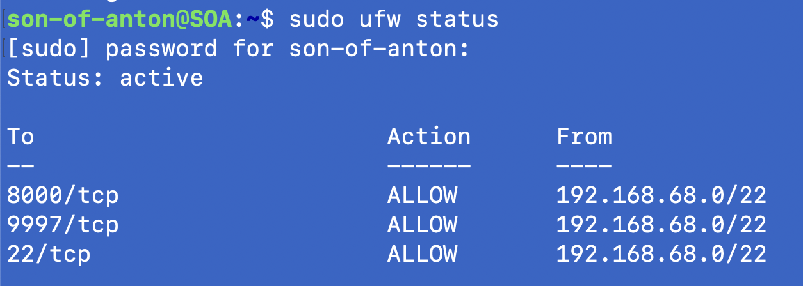

# UFW Host Firewall Setup - Ubuntu (Desktop PC / Server)

UFW was enabled to add a simple **host-based firewall layer** on "Son-Of-Anton" (the desktop PC / server running Splunk + Docker services), so inbound traffic is explicitly controlled and firewall activity can be logged and monitored in Splunk.

**Host:** Desktop PC / Server (SOA)  
**OS:** Ubuntu 24.04 LTS  
**Role:** Host Firewall (UFW)  
**Splunk Index used:** endpoints  
**Splunk Sourcetype:** ufw  
**Log File:** /var/log/ufw.log  

---

## 1) Verify UFW is Installed and Check Status (Inactive vs Active)

UFW was already present on this host (no installation needed). To verify it exists:

```bash
sudo ufw --version
```

To check whether it is currently enabled:
```bash
sudo ufw status
```

If the status is **inactive**, UFW is installed but not enforcing rules yet. It will be enabled after the rules are defined.

---

## 2) Configure Allow Rules (LAN only)

I restricted these services to the LAN only to minimize attack surface while my Cyberlab is still being built and validated, before any intentional external/VPN exposure is introduced.

Allow required inbound services **from LAN only** (192.168.68.0/22):
```bash
sudo ufw allow from 192.168.68.0/22 to any port 22 proto tcp  
sudo ufw allow from 192.168.68.0/22 to any port 8000 proto tcp  
sudo ufw allow from 192.168.68.0/22 to any port 9997 proto tcp  
```

**What these are for (SOA):**
- **22/tcp** — SSH administration (LAN only)
- **8000/tcp** — Splunk Web UI (LAN only)
- **9997/tcp** — Splunk receiving port for forwarders (LAN only)

To ensure only the intended LAN-only rules remain, I removed any pre-existing UFW rules that were not part of this configuration:

```bash
sudo ufw status numbered    
sudo ufw delete <rule_number>
```

---

## 3) Enable Logging (Visibility)

I set logging level to **medium** because it captures more useful security-relevant events (blocks/allows/audits) for Splunk analysis without generating the excessive noise and disk usage of full debug logging:
```bash
sudo ufw logging medium 
``` 

---

## 4) Enable UFW and Verify Rules

Enable UFW:
```bash
sudo ufw enable  
```

Confirm status and active rules:
```bash
sudo ufw status  
```
Final ruleset (confirmed):



---

## 5) Splunk Ingestion (inputs.conf)

Configure the local Splunk instance on SOA to monitor the UFW log file:
```bash
sudo nano /opt/splunk/etc/system/local/inputs.conf 
``` 

Add:
```bash
[monitor:///var/log/ufw.log]
disabled = 0
index = endpoints
sourcetype = ufw
crcSalt = <SOURCE>
```

**Why crcSalt is set:**  
crcSalt ties Splunk’s file-identification checksum to the source path, reducing the chance of missed or duplicated ingestion during log rotation or when multiple logs share similar starting lines. I don't think it's absolutley necessary to set it but did it to be safe.

---

## 6) Restart Splunk and Validate Data

Restart Splunk so the new monitor stanza is loaded:
```bash
sudo /opt/splunk/bin/splunk restart
```

Confirm UFW events are arriving in Splunk:
```bash
index=endpoints sourcetype=UFW host=SOA earliest=-15m
| stats count
```

---

## 7) Field Extraction (UFWACTION)

By default, Splunk did not automatically extract the UFW action state (e.g., BLOCK, ALLOW, AUDIT, AUDIT INVALID).  
To make this searchable and usable in dashboards/detections, I created a custom field extraction for **UFWACTION** based on the raw event text.

**Field name:** UFWACTION  
**Purpose:** Extract the action label from the UFW bracket header (e.g., [UFW BLOCK], [UFW AUDIT], [UFW AUDIT INVALID])

**Regex used:**
```bash
\[\[?UFW\s+(?P<UFWACTION>[A-Z]+(?:\s+[A-Z]+)*)\]
```

**Regex breakdown (why it works):**
- `\[  `       — matches the opening "[" of the UFW tag
- `\[?`        — optionally matches a second "[" (covers rare "[[UFW ...]" formatting)
- `UFW\s+ `    — matches the literal "UFW" plus at least one space
- `(?P<UFWACTION> ...`) — named capture group that becomes the field UFWACTION
- `[A-Z]+ `    — captures the first word (BLOCK / ALLOW / AUDIT)
- `(?:\s+[A-Z]+)*` — captures any additional uppercase words (e.g., "AUDIT INVALID")
- `\] `        — matches the closing "]"

**Notes:**
- Handles standard formats like: [UFW BLOCK], [UFW ALLOW], [UFW AUDIT]
- Also captures multi-word actions like: [UFW AUDIT INVALID]
- The optional extra "[" accounts for occasional double-bracket formatting seen in some events

## Notes

- UFW is a **host firewall** on SOA (not a standalone network firewall appliance).
- Logging level was set to **medium** for useful inbound deny/allow visibility without extreme noise.
- UFW logs are written to: /var/log/ufw.log
- If changes are made to inputs.conf, a Splunk restart is typically required for the monitor to load.